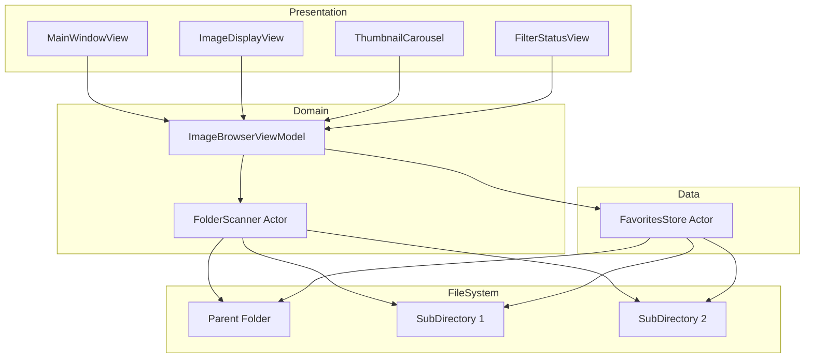
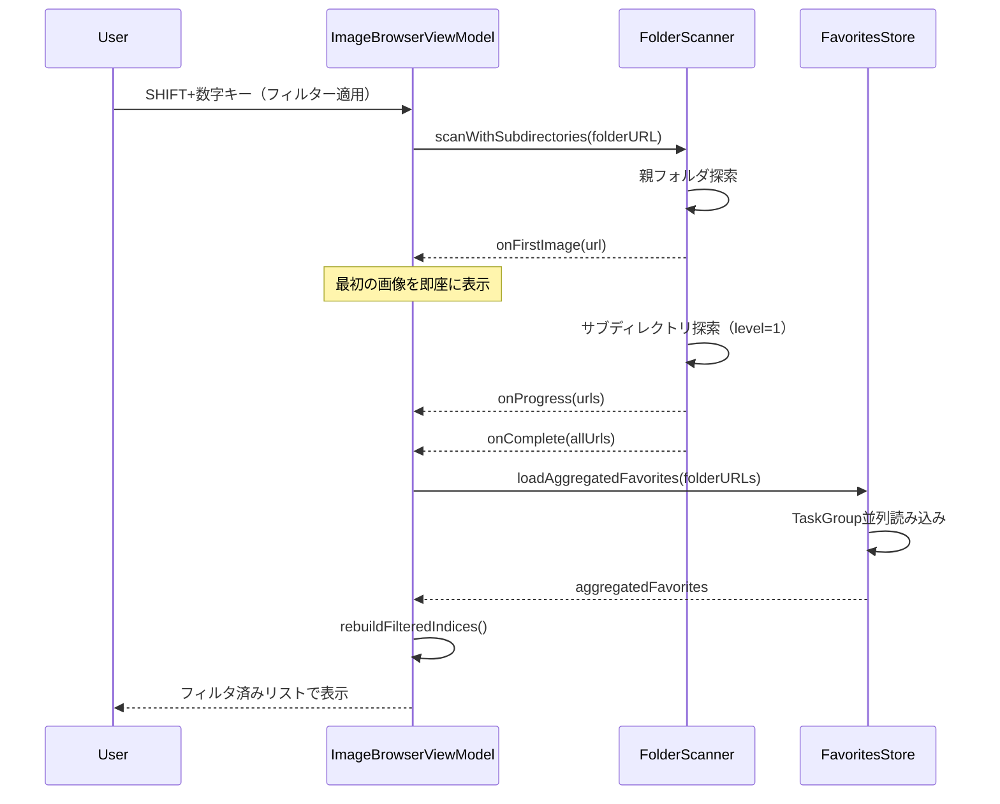
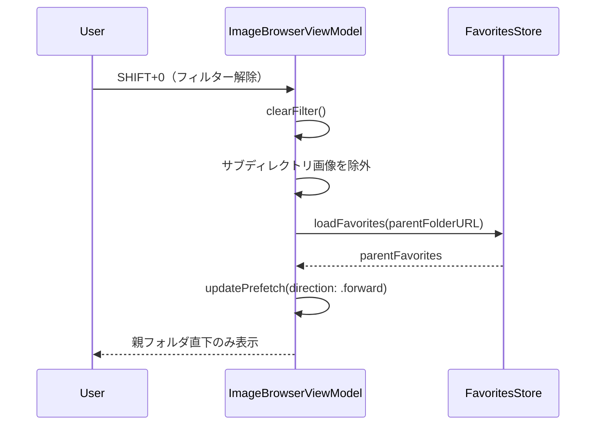
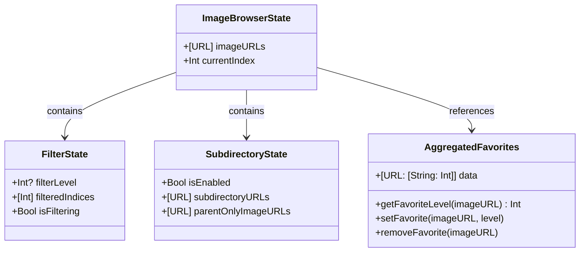

# Design Document

## Overview

**Purpose**: お気に入りフィルター使用時に親ディレクトリと1階層下のサブディレクトリを横断して画像を一覧表示する機能を提供する。複数フォルダに分散した高評価画像をまとめて確認できるようにする。

**Users**: 画像生成AIを利用するクリエイター・研究者が、サブディレクトリに分類された大量の生成画像から高品質な画像を効率的に選別・確認するために使用する。

**Impact**: 既存の`FolderScanner`、`FavoritesStore`、`ImageBrowserViewModel`を拡張し、フィルター適用時のみサブディレクトリ探索と複数フォルダのお気に入り統合を行う。既存の`favorites.json`フォーマットは変更しない。

### Goals
- お気に入りフィルター適用時に親フォルダと1階層下のサブディレクトリの画像を統合表示
- 各サブフォルダの`.aiview/favorites.json`を読み込み、お気に入り情報を統合
- フィルター解除時は親ディレクトリ直下のみの表示に復帰
- サブディレクトリスキャン時も最初の画像を即座に表示

### Non-Goals
- 2階層以上のサブディレクトリ探索
- `favorites.json`フォーマットの変更
- フィルター非適用時のサブディレクトリ探索
- サブディレクトリ間でのお気に入りデータの移動・同期

## Architecture

### Existing Architecture Analysis

- **Current architecture patterns**: Clean Architectureによる層分離（Presentation/Domain/Data）、actorパターンによるスレッドセーフ実装
- **Existing domain boundaries**:
  - `FolderScanner`（actor）: 親フォルダ直下の画像スキャン
  - `FavoritesStore`（actor）: 単一フォルダのお気に入り管理
  - `ImageBrowserViewModel`（@MainActor）: UI状態・フィルタリングロジック
- **Integration points**:
  - `FolderScanner.scan`にサブディレクトリ探索オプション追加
  - `FavoritesStore`に複数フォルダ読み込みメソッド追加
  - `ImageBrowserViewModel`にサブディレクトリ込みのフィルタリング状態管理追加
- **Technical debt addressed**: なし（拡張のみ）

### Architecture Pattern & Boundary Map

**Architecture Integration**:
- **Selected pattern**: 既存のClean Architectureを維持し、各層のコンポーネントを拡張
- **Domain/feature boundaries**: フィルター適用時のみサブディレクトリモードが有効化される条件付き拡張
- **Existing patterns preserved**: actorパターン、`@Observable`による状態管理、`@MainActor`によるUI状態分離
- **New components rationale**: 新規コンポーネントは追加せず、既存コンポーネントの拡張で対応
- **Steering compliance**: 既存のプロジェクト構造・命名規則・ログカテゴリに準拠



### Technology Stack

| Layer | Choice / Version | Role in Feature | Notes |
|-------|------------------|-----------------|-------|
| Frontend | SwiftUI (macOS 13+) | 既存UIの再利用 | 変更なし |
| Backend | Swift Concurrency (actor, TaskGroup) | サブディレクトリ探索、並列favorites読み込み | TaskGroup追加 |
| Data | JSON (Codable) | 各フォルダのfavorites.jsonを個別に読み書き | フォーマット変更なし |
| Storage | File System (.aiview/) | 各フォルダ個別の永続化を維持 | 既存パターン準拠 |

## System Flows

### サブディレクトリスキャンフロー



**Key Decisions**:
- 最初の画像発見時点で即座にコールバック（パフォーマンス優先）
- サブディレクトリ探索は`enumerator.level`で1階層のみに制限
- お気に入り読み込みはTaskGroupで並列化

### フィルター解除フロー



**Key Decisions**:
- サブディレクトリの画像をリストから除外
- 現在表示中画像がサブディレクトリの場合は親フォルダの先頭に移動
- お気に入りデータは親フォルダのみに復帰

## Requirements Traceability

| Requirement | Summary | Components | Interfaces | Flows |
|-------------|---------|------------|------------|-------|
| 1.1 | フィルター適用時にサブディレクトリを探索 | FolderScanner, ImageBrowserViewModel | scanWithSubdirectories() | サブディレクトリスキャンフロー |
| 1.2 | 対応画像拡張子のみフィルタリング | FolderScanner | supportedExtensions | サブディレクトリスキャンフロー |
| 1.3 | 隠しファイル・隠しフォルダをスキップ | FolderScanner | .skipsHiddenFiles | サブディレクトリスキャンフロー |
| 1.4 | フィルター解除時は親フォルダ直下のみに戻る | ImageBrowserViewModel | clearFilter() | フィルター解除フロー |
| 2.1 | 各サブディレクトリのfavorites.jsonを読み込み | FavoritesStore | loadAggregatedFavorites() | サブディレクトリスキャンフロー |
| 2.2 | お気に入り情報をメモリ上で統合 | FavoritesStore | AggregatedFavorites | サブディレクトリスキャンフロー |
| 2.3 | 画像が属するフォルダのfavorites.jsonに保存 | FavoritesStore | setFavorite() | - |
| 2.4 | 既存のfavorites.jsonフォーマットを維持 | FavoritesStore | saveToDisk() | - |
| 3.1 | 統合されたお気に入り情報でフィルタリング | ImageBrowserViewModel | rebuildFilteredIndices() | サブディレクトリスキャンフロー |
| 3.2 | フィルタ条件に合致する画像のみナビゲーション | ImageBrowserViewModel | moveToNext(), moveToPrevious() | - |
| 3.3 | サブディレクトリを含む全画像のプリフェッチ | ImageBrowserViewModel | updateFilteredPrefetch() | - |
| 3.4 | お気に入り変更時にフィルタ結果を再計算 | ImageBrowserViewModel | handleFilteredIndexChange() | - |
| 4.1 | 最初の画像を即座にコールバック | FolderScanner | onFirstImage | サブディレクトリスキャンフロー |
| 4.2 | 1階層のみの探索に制限 | FolderScanner | enumerator.level | サブディレクトリスキャンフロー |
| 4.3 | favorites.json読み込みを並列実行 | FavoritesStore | withTaskGroup | サブディレクトリスキャンフロー |
| 5.1 | フィルター解除時に親フォルダ直下のみに戻る | ImageBrowserViewModel | clearFilter() | フィルター解除フロー |
| 5.2 | フィルター解除時に親フォルダのお気に入りのみ保持 | FavoritesStore | loadFavorites() | フィルター解除フロー |
| 5.3 | 別フォルダを開く時にフィルター状態をリセット | ImageBrowserViewModel | openFolder() | - |

## Components and Interfaces

| Component | Domain/Layer | Intent | Req Coverage | Key Dependencies | Contracts |
|-----------|--------------|--------|--------------|------------------|-----------|
| FolderScanner | Domain | サブディレクトリ探索付きスキャン | 1.1, 1.2, 1.3, 1.4, 4.1, 4.2 | FileManager (P0) | Service |
| FavoritesStore | Data | 複数フォルダのお気に入り統合管理 | 2.1, 2.2, 2.3, 2.4, 4.3, 5.2 | FileManager (P0) | Service |
| ImageBrowserViewModel | Domain | サブディレクトリ込みフィルタリング状態管理 | 1.1, 1.4, 3.1, 3.2, 3.3, 3.4, 5.1, 5.3 | FolderScanner (P0), FavoritesStore (P0) | Service, State |

### Domain

#### FolderScanner（拡張）

| Field | Detail |
|-------|--------|
| Intent | サブディレクトリを含む画像ファイルのストリーミング列挙 |
| Requirements | 1.1, 1.2, 1.3, 1.4, 4.1, 4.2 |

**Responsibilities & Constraints**
- 親フォルダと1階層下のサブディレクトリの画像を探索
- `enumerator.level`で探索深度を1階層に制限
- 最初の画像発見時に即座にコールバック
- 隠しファイル・隠しフォルダをスキップ

**Dependencies**
- External: FileManager — ディレクトリ列挙 (P0)
- Inbound: ImageBrowserViewModel — スキャン要求 (P0)

**Contracts**: Service [x]

##### Service Interface（追加メソッド）
```swift
actor FolderScanner {
    /// サブディレクトリを含むスキャン
    /// - Parameters:
    ///   - folderURL: スキャン対象の親フォルダURL
    ///   - includeSubdirectories: サブディレクトリを含めるか（1階層のみ）
    ///   - onFirstImage: 最初の画像が見つかった時のコールバック
    ///   - onProgress: 進行状況のコールバック
    ///   - onComplete: 完了時のコールバック（全URLの配列）
    ///   - onSubdirectories: 発見したサブディレクトリURLのコールバック
    func scan(
        folderURL: URL,
        includeSubdirectories: Bool,
        onFirstImage: @Sendable (URL) async -> Void,
        onProgress: @Sendable ([URL]) async -> Void,
        onComplete: @Sendable ([URL]) async -> Void,
        onSubdirectories: @Sendable ([URL]) async -> Void
    ) async throws
}
```
- Preconditions: `folderURL`がアクセス可能なディレクトリであること
- Postconditions: `includeSubdirectories=true`の場合、1階層下のサブディレクトリも探索
- Invariants: `onFirstImage`は最初の画像発見時に1回のみ呼び出し

**Implementation Notes**
- 既存の`scan`メソッドとオーバーロードとして共存
- `includeSubdirectories=false`の場合は既存動作と同一
- `.skipsSubdirectoryDescendants`オプションを条件付きで適用
- `enumerator.level`でサブディレクトリ（level=1）とそれ以上（level>1）を判定

---

#### ImageBrowserViewModel（拡張）

| Field | Detail |
|-------|--------|
| Intent | サブディレクトリを含むフィルタリング状態とナビゲーション管理 |
| Requirements | 1.1, 1.4, 3.1, 3.2, 3.3, 3.4, 5.1, 5.3 |

**Responsibilities & Constraints**
- フィルター適用時にサブディレクトリスキャンをトリガー
- サブディレクトリを含む`imageURLs`の管理
- 統合されたお気に入り情報でのフィルタリング
- フィルター解除時に親フォルダ直下のみの状態に復帰

**Dependencies**
- Outbound: FolderScanner — サブディレクトリスキャン (P0)
- Outbound: FavoritesStore — 複数フォルダお気に入り読み込み (P0)

**Contracts**: Service [x] / State [x]

##### State Management（追加プロパティ）
```swift
@Observable
final class ImageBrowserViewModel {
    // 既存のプロパティは維持

    // サブディレクトリ関連
    /// サブディレクトリスキャンモードが有効かどうか
    private(set) var isSubdirectoryMode: Bool = false

    /// 親フォルダ直下の画像URL（フィルター解除時の復元用）
    private var parentOnlyImageURLs: [URL] = []

    /// 発見したサブディレクトリURL
    private var subdirectoryURLs: [URL] = []

    /// 統合されたお気に入りデータ（フォルダパス→ファイル名→レベル）
    private var aggregatedFavorites: [URL: [String: Int]] = [:]

    // Computed Properties
    /// 現在の画像のお気に入りレベル（サブディレクトリ対応）
    var currentFavoriteLevel: Int {
        guard let url = currentImageURL else { return 0 }
        let folderURL = url.deletingLastPathComponent()
        return aggregatedFavorites[folderURL]?[url.lastPathComponent] ?? 0
    }
}
```

##### Service Interface（追加・変更メソッド）
```swift
extension ImageBrowserViewModel {
    /// フィルタリングを開始（サブディレクトリスキャン付き）
    /// Requirements: 1.1, 3.1
    func setFilterLevel(_ level: Int) async

    /// フィルタリングを解除（親フォルダ直下のみに復帰）
    /// Requirements: 1.4, 5.1
    func clearFilter() async

    /// お気に入りレベルを設定（サブディレクトリ対応）
    /// Requirements: 2.3, 3.4
    func setFavoriteLevel(_ level: Int) async throws

    /// お気に入りを解除（サブディレクトリ対応）
    /// Requirements: 2.3, 3.4
    func removeFavorite() async throws
}
```
- Preconditions: フォルダが開かれていること
- Postconditions: `setFilterLevel`後は`isSubdirectoryMode=true`、`clearFilter`後は`false`
- Invariants: `currentIndex`は常に`imageURLs`内の有効なインデックス

**Implementation Notes**
- `setFilterLevel`を`async`に変更（サブディレクトリスキャン待機のため）
- `clearFilter`も`async`に変更（状態復元のため）
- フィルター適用時、まずサブディレクトリスキャンを実行してから`rebuildFilteredIndices`
- フィルター解除時、`imageURLs`を`parentOnlyImageURLs`で置き換え

---

### Data

#### FavoritesStore（拡張）

| Field | Detail |
|-------|--------|
| Intent | 複数フォルダのお気に入り情報の統合読み込みと個別保存 |
| Requirements | 2.1, 2.2, 2.3, 2.4, 4.3, 5.2 |

**Responsibilities & Constraints**
- 親フォルダと複数サブディレクトリの`favorites.json`を並列読み込み
- 統合されたお気に入りデータをフォルダ別に管理
- 保存時は画像が属するフォルダの`favorites.json`に書き込み
- 既存の`favorites.json`フォーマットを変更しない

**Dependencies**
- External: FileManager — ファイル読み書き (P0)
- Inbound: ImageBrowserViewModel — お気に入り操作要求 (P0)

**Contracts**: Service [x]

##### Service Interface（追加メソッド）
```swift
actor FavoritesStore {
    /// 複数フォルダのお気に入りを並列読み込み
    /// - Parameter folderURLs: 読み込み対象のフォルダURL配列
    /// - Returns: フォルダURL→（ファイル名→レベル）のマッピング
    func loadAggregatedFavorites(for folderURLs: [URL]) async -> [URL: [String: Int]]

    /// 指定画像のお気に入りレベルを設定（属するフォルダに保存）
    /// - Parameters:
    ///   - url: 画像のURL
    ///   - level: お気に入りレベル（1〜5）
    func setFavorite(for url: URL, level: Int) async throws

    /// 指定画像のお気に入りを解除（属するフォルダから削除）
    /// - Parameter url: 画像のURL
    func removeFavorite(for url: URL) async throws

    /// 指定画像のお気に入りレベルを取得（統合データから）
    /// - Parameter url: 画像のURL
    /// - Returns: お気に入りレベル（0は未設定）
    func getFavoriteLevel(for url: URL) -> Int
}
```
- Preconditions: `loadAggregatedFavorites`または`loadFavorites`呼び出し後に他のメソッドを使用
- Postconditions: `setFavorite`/`removeFavorite`後は該当フォルダの`favorites.json`に即時保存
- Invariants: 各フォルダの`favorites.json`フォーマットは`[String: Int]`を維持

##### State Management（追加プロパティ）
```swift
actor FavoritesStore {
    /// 統合されたお気に入りデータ（フォルダURL→ファイル名→レベル）
    private var aggregatedFavorites: [URL: [String: Int]] = [:]

    /// 現在統合モードかどうか
    private var isAggregatedMode: Bool = false
}
```

**Implementation Notes**
- `loadAggregatedFavorites`は`withTaskGroup`で並列読み込み
- `setFavorite`は画像URLからフォルダURLを導出し、該当フォルダのデータを更新
- 単一フォルダモードと統合モードの両方をサポート
- `loadFavorites`呼び出しで統合モードを解除

---

## Data Models

### Domain Model



### Logical Data Model

**お気に入りデータ構造（各フォルダの`.aiview/favorites.json`）**:
```json
{
  "image001.png": 5,
  "image002.png": 3
}
```

**メモリ上の統合データ構造**:
```swift
/// フォルダURL → (ファイル名 → レベル)
typealias AggregatedFavorites = [URL: [String: Int]]

// 例:
// [
//   file:///Users/.../ParentFolder/: ["img1.png": 5, "img2.png": 3],
//   file:///Users/.../ParentFolder/SubA/: ["img3.png": 4],
//   file:///Users/.../ParentFolder/SubB/: ["img4.png": 2]
// ]
```

**ファイル仕様**:
- 保存先: `<各フォルダ>/.aiview/favorites.json`
- エンコーディング: UTF-8
- フォーマット: JSON（キー=ファイル名、値=お気に入りレベル1-5）
- 変更なし: 既存フォーマットを完全に維持

## Error Handling

### Error Strategy
- **Fail Fast**: 親フォルダへのアクセス失敗は即座にエラー表示
- **Graceful Degradation**: 個別サブディレクトリの`favorites.json`読み込み失敗時は空の辞書として扱い、他のフォルダは正常に処理
- **User Context**: エラーメッセージは日本語で表示

### Error Categories and Responses

| Category | Error | Response |
|----------|-------|----------|
| System Errors | サブディレクトリアクセス失敗 | 警告ログ出力、該当サブディレクトリをスキップして継続 |
| System Errors | 個別`favorites.json`読み込み失敗 | 警告ログ出力、空の辞書として扱い継続 |
| System Errors | `favorites.json`書き込み失敗 | 警告ログ出力、メモリ上の状態は維持 |
| Business Logic | フィルタ結果が0件 | 「該当画像がありません」メッセージ表示（既存動作） |

### Monitoring
- 既存の`Logger.folderScanner`カテゴリでサブディレクトリスキャンログ出力
- 既存の`Logger.favorites`カテゴリで統合読み込みログ出力

## Testing Strategy

### Unit Tests
- **FolderScanner**:
  - `includeSubdirectories=true`でサブディレクトリが探索されること
  - `enumerator.level > 1`の深い階層がスキップされること
  - 隠しフォルダがスキップされること
  - 最初の画像発見時に`onFirstImage`が呼ばれること
- **FavoritesStore**:
  - `loadAggregatedFavorites`で複数フォルダのデータが統合されること
  - 並列読み込みが正しく動作すること
  - `setFavorite`が正しいフォルダに保存されること
  - 統合モード中の`getFavoriteLevel`が正しい値を返すこと
- **ImageBrowserViewModel**:
  - `setFilterLevel`でサブディレクトリスキャンがトリガーされること
  - `clearFilter`で親フォルダ直下のみに復帰すること
  - サブディレクトリ画像へのお気に入り設定が正しいフォルダに保存されること

### Integration Tests
- フォルダオープン→フィルター適用→サブディレクトリスキャン→お気に入り統合のフロー
- サブディレクトリ画像にお気に入り設定→該当フォルダに保存→再読み込みで復元のフロー
- フィルター適用→ナビゲーション→フィルター解除→親フォルダ直下のみ表示のフロー

### E2E/UI Tests
- SHIFT+1〜5でサブディレクトリを含むフィルタリング
- フィルタリング中のカーソルキーでサブディレクトリ画像を含むナビゲーション
- サブディレクトリ画像に数字キーでお気に入り設定

## Performance & Scalability

### Target Metrics
| Metric | Target |
|--------|--------|
| 最初の画像表示 | < 100ms（サブディレクトリスキャン開始後） |
| フィルター適用完了 | < 500ms（親+10サブディレクトリ、各100枚） |
| favorites.json並列読み込み | < 200ms（10フォルダ） |
| ナビゲーション | 既存と同等（< 50ms） |

### Optimization Techniques
- 最初の画像発見時に即座にコールバック（体感速度向上）
- `withTaskGroup`による`favorites.json`並列読み込み
- `filteredIndices`はInt配列で軽量（URLを複製しない）
- サブディレクトリスキャン結果をキャッシュし、同一フォルダでの再フィルター時に再利用
