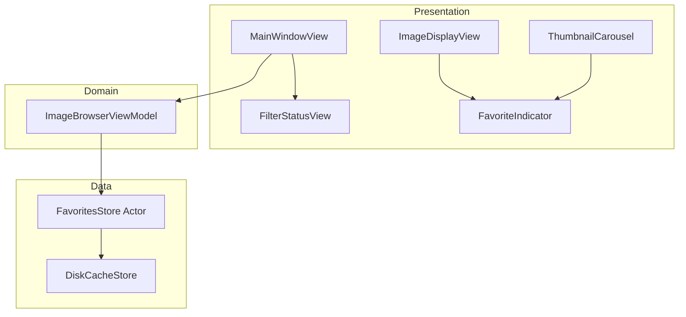
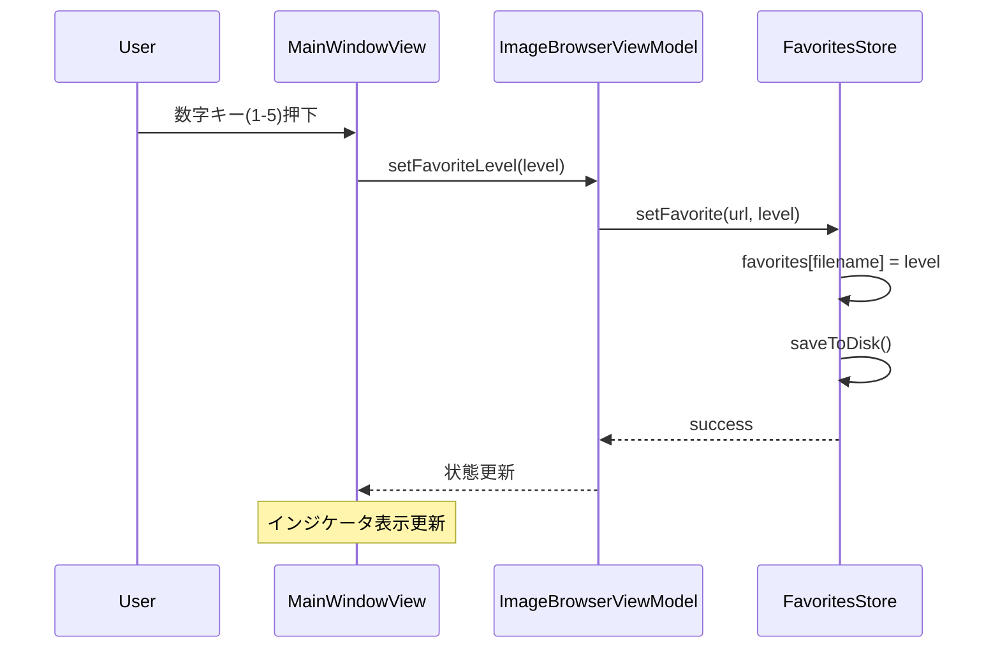
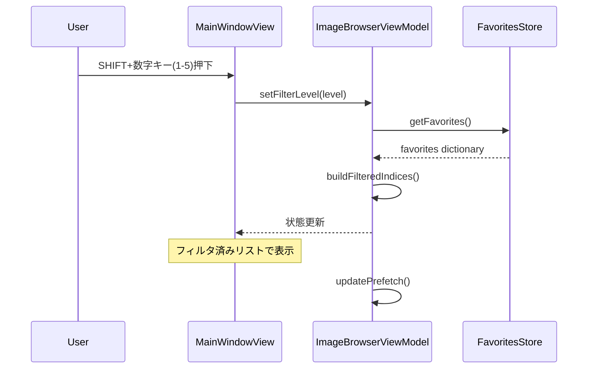
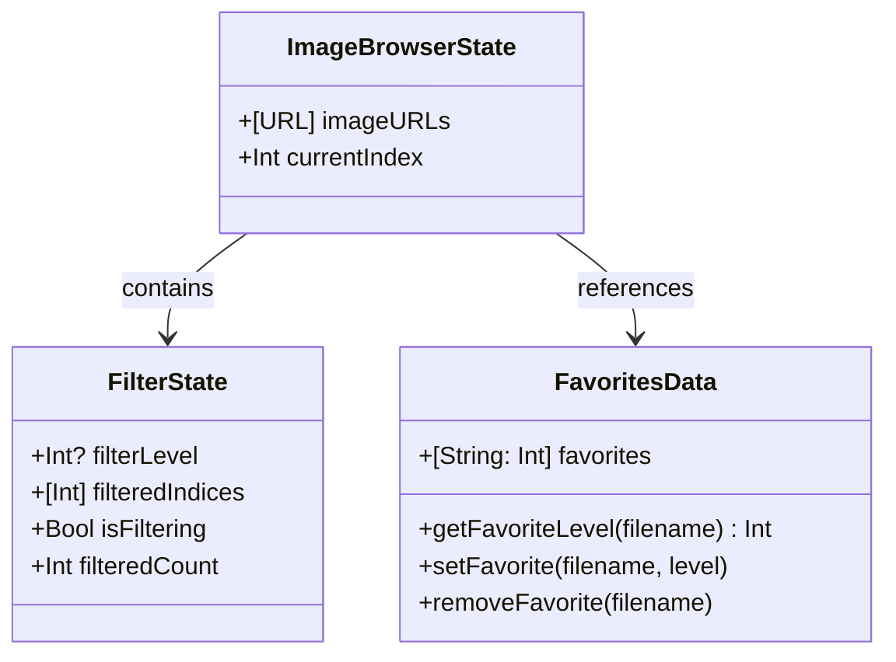

# Design Document

## Overview

**Purpose**: AIviewに画像ごとのお気に入りレベル設定（1〜5段階）と、指定レベル以上の画像のみを表示するフィルタリング機能を提供する。

**Users**: 画像生成AIを利用するクリエイター・研究者が、大量の生成画像から高品質な画像を効率的に選別・管理するために使用する。

**Impact**: 既存の`ImageBrowserViewModel`を拡張し、`.aiview`フォルダにお気に入り情報を永続化する。フィルタリング機能により、選別作業の効率が大幅に向上する。

### Goals
- 数字キー1〜5でお気に入りレベルを設定、0で解除
- SHIFT+数字キーで指定レベル以上の画像をフィルタリング表示
- お気に入り情報をフォルダごとに永続化（`.aiview/favorites.json`）
- フィルタリング中もスムーズなナビゲーションとプリフェッチを維持

### Non-Goals
- 複数フォルダにまたがるお気に入り管理
- お気に入り画像の自動エクスポート機能
- お気に入りレベルのカスタマイズ（6段階以上）
- タグベースのフィルタリング

## Architecture

### Existing Architecture Analysis

- **Current architecture patterns**: Clean Architectureによる層分離（Presentation/Domain/Data）
- **Existing domain boundaries**: `ImageBrowserViewModel`がUI状態を管理、Data層がファイル永続化を担当
- **Integration points**:
  - `ImageBrowserViewModel`へのフィルタリング状態とお気に入り操作の追加
  - `MainWindowView.handleKeyPress`への数字キー・SHIFT+数字キーのハンドリング追加
  - 新規`FavoritesStore`の作成（Data層）
- **Technical debt addressed**: なし

### Architecture Pattern & Boundary Map

**Architecture Integration**:
- **Selected pattern**: 既存のClean Architectureを維持し、Data層に`FavoritesStore`を追加
- **Domain/feature boundaries**: お気に入り永続化はData層、フィルタリングロジックはDomain層（ViewModel）
- **Existing patterns preserved**: actorパターン（スレッドセーフ）、`@Observable`による状態管理
- **New components rationale**: `FavoritesStore`はお気に入り専用の永続化を担当し、単一責任原則を維持
- **Steering compliance**: 既存のプロジェクト構造・命名規則に準拠



### Technology Stack

| Layer | Choice / Version | Role in Feature | Notes |
|-------|------------------|-----------------|-------|
| Frontend | SwiftUI (macOS 13+) | お気に入りインジケータ、フィルタステータス表示 | 既存パターン準拠 |
| Backend | Swift Concurrency (actor) | `FavoritesStore`のスレッドセーフ実装 | 既存パターン準拠 |
| Data | JSON (Codable) | お気に入りデータのシリアライズ | 軽量・可読性 |
| Storage | File System (.aiview/) | `favorites.json`の永続化 | 既存のサムネイルキャッシュと同じディレクトリ |

## System Flows

### お気に入りレベル設定フロー



**Key Decisions**:
- ファイル名をキーとして使用（パス変更に対応、同一フォルダ内の重複は想定しない）
- 保存は即座に実行（遅延書き込みは行わない）

### フィルタリング開始フロー



**Key Decisions**:
- フィルタリングはメモリ内で完結（ディスクI/Oなし）
- `filteredIndices`は元の`imageURLs`へのインデックス配列として保持
- フィルタ変更時にプリフェッチウィンドウも更新

## Requirements Traceability

| Requirement | Summary | Components | Interfaces | Flows |
|-------------|---------|------------|------------|-------|
| 1.1 | 数字キー1〜5でお気に入りレベル設定 | MainWindowView, ImageBrowserViewModel, FavoritesStore | KeyboardHandler, setFavoriteLevel() | お気に入り設定フロー |
| 1.2 | 数字キー0でお気に入り解除 | MainWindowView, ImageBrowserViewModel, FavoritesStore | KeyboardHandler, removeFavorite() | お気に入り設定フロー |
| 1.3 | お気に入りレベルの視覚的インジケータ | ImageDisplayView, ThumbnailCarousel, FavoriteIndicator | State binding | - |
| 1.4 | お気に入りレベルを1〜5の整数で管理 | FavoritesStore | FavoriteLevel type | - |
| 2.1 | .aiviewファイルへのお気に入り保存 | FavoritesStore | saveFavorites() | お気に入り設定フロー |
| 2.2 | フォルダオープン時のお気に入り読み込み | ImageBrowserViewModel, FavoritesStore | loadFavorites() | フォルダオープンフロー |
| 2.3 | .aiviewファイル未存在時の初期化 | FavoritesStore | loadFavorites() | フォルダオープンフロー |
| 2.4 | ファイル名とレベルのマッピング保存 | FavoritesStore | Favorites type | - |
| 3.1 | SHIFT+1〜5でレベル以上をフィルタリング | MainWindowView, ImageBrowserViewModel | setFilterLevel() | フィルタリング開始フロー |
| 3.2 | SHIFT+0でフィルタリング解除 | MainWindowView, ImageBrowserViewModel | clearFilter() | フィルタリング解除フロー |
| 3.3 | フィルタリング時のメインビュー表示制御 | ImageBrowserViewModel, ImageDisplayView | filteredIndices state | - |
| 3.4 | フィルタリング時のサムネイルカルーセル表示制御 | ImageBrowserViewModel, ThumbnailCarousel | filteredImageURLs computed | - |
| 3.5 | フィルタリング時のナビゲーション制御 | ImageBrowserViewModel | moveToNext(), moveToPrevious() | ナビゲーションフロー |
| 4.1 | フィルタリング条件の画面表示 | FilterStatusView | filterLevel state | - |
| 4.2 | フィルタリング後の画像数表示 | FilterStatusView, ImageBrowserViewModel | filteredCount computed | - |
| 4.3 | 該当画像なし時のメッセージ表示 | ImageDisplayView | isFilterEmpty state | - |
| 5.1 | フィルタリング時の次画像移動 | ImageBrowserViewModel | moveToNextFiltered() | ナビゲーションフロー |
| 5.2 | フィルタリング時の前画像移動 | ImageBrowserViewModel | moveToPreviousFiltered() | ナビゲーションフロー |
| 5.3 | フィルタリング時のプリフェッチ制御 | ImageBrowserViewModel | updatePrefetch() | プリフェッチフロー |
| 5.4 | フィルタリング解除時の位置維持 | ImageBrowserViewModel | clearFilter() | フィルタリング解除フロー |

## Components and Interfaces

| Component | Domain/Layer | Intent | Req Coverage | Key Dependencies | Contracts |
|-----------|--------------|--------|--------------|------------------|-----------|
| FavoritesStore | Data | お気に入り情報の永続化 | 2.1-2.4 | DiskCacheStore (P1) | Service |
| ImageBrowserViewModel | Domain | フィルタリング状態とナビゲーション拡張 | 1.1-1.4, 3.1-3.5, 5.1-5.4 | FavoritesStore (P0) | Service, State |
| FavoriteIndicator | Presentation | お気に入りレベルの視覚的表示 | 1.3, 4.1-4.2 | ImageBrowserViewModel (P0) | State |
| FilterStatusView | Presentation | フィルタリング状態のステータスバー表示 | 4.1-4.3 | ImageBrowserViewModel (P0) | State |
| MainWindowView | Presentation | 数字キー・SHIFT+数字キーのハンドリング | 1.1-1.2, 3.1-3.2 | ImageBrowserViewModel (P0) | State |

### Data

#### FavoritesStore

| Field | Detail |
|-------|--------|
| Intent | フォルダごとのお気に入り情報の永続化管理 |
| Requirements | 2.1, 2.2, 2.3, 2.4 |

**Responsibilities & Constraints**
- `.aiview/favorites.json`へのお気に入り情報の読み書き
- ファイル名をキー、お気に入りレベル(1-5)を値とするマッピング管理
- フォルダ変更時のデータ切り替え

**Dependencies**
- External: FileManager — ファイル読み書き (P0)
- Inbound: ImageBrowserViewModel — お気に入り操作要求 (P0)

**Contracts**: Service [x]

##### Service Interface
```swift
actor FavoritesStore {
    /// お気に入りデータのファイル名
    private let favoritesFileName = "favorites.json"

    /// 現在のフォルダURL
    private var currentFolderURL: URL?

    /// メモリ上のお気に入りデータ（ファイル名→レベル）
    private var favorites: [String: Int] = [:]

    /// 指定フォルダのお気に入りを読み込み
    func loadFavorites(for folderURL: URL) async

    /// お気に入りレベルを設定（1-5）
    func setFavorite(for url: URL, level: Int) async throws

    /// お気に入りを解除
    func removeFavorite(for url: URL) async throws

    /// 指定ファイルのお気に入りレベルを取得（未設定は0）
    func getFavoriteLevel(for url: URL) -> Int

    /// 全お気に入りデータを取得
    func getAllFavorites() -> [String: Int]
}
```
- Preconditions: `loadFavorites`呼び出し後に他のメソッドを使用
- Postconditions: `setFavorite`/`removeFavorite`後はディスクに即時保存
- Invariants: お気に入りレベルは1〜5の範囲、0は未設定

**Implementation Notes**
- `.aiview`フォルダが存在しない場合は作成
- JSON書き込みは`.atomic`オプションで安全に保存
- 読み込み失敗時は空の辞書として初期化（エラー握りつぶし）

---

### Domain

#### ImageBrowserViewModel（拡張）

| Field | Detail |
|-------|--------|
| Intent | フィルタリング状態の管理とお気に入り操作の調整 |
| Requirements | 1.1, 1.2, 1.3, 1.4, 3.1, 3.2, 3.3, 3.4, 3.5, 5.1, 5.2, 5.3, 5.4 |

**Responsibilities & Constraints**
- フィルタリング状態（有効/無効、フィルタレベル）の管理
- `filteredIndices`（フィルタ条件に合致する元リストのインデックス）の計算
- フィルタリング中のナビゲーションロジック
- お気に入り操作の`FavoritesStore`への委譲

**Dependencies**
- Outbound: FavoritesStore — お気に入り読み書き (P0)

**Contracts**: Service [x] / State [x]

##### State Management（追加プロパティ）
```swift
@Observable
final class ImageBrowserViewModel {
    // 既存のプロパティは維持

    // お気に入り関連
    private(set) var favorites: [String: Int] = [:]

    // フィルタリング関連
    private(set) var filterLevel: Int? = nil  // nil = フィルタなし、1-5 = フィルタ有効
    private(set) var filteredIndices: [Int] = []  // 元のimageURLsへのインデックス

    // Computed Properties
    var isFiltering: Bool { filterLevel != nil }

    var filteredImageURLs: [URL] {
        filteredIndices.map { imageURLs[$0] }
    }

    var filteredCount: Int { filteredIndices.count }

    var currentFavoriteLevel: Int {
        guard let url = currentImageURL else { return 0 }
        return favorites[url.lastPathComponent] ?? 0
    }

    var filterStatusText: String {
        guard let level = filterLevel else {
            return imageCountText
        }
        return "★\(level)+ : \(currentFilteredIndex + 1) / \(filteredCount)枚"
    }
}
```

##### Service Interface（追加メソッド）
```swift
extension ImageBrowserViewModel {
    // お気に入り操作
    func setFavoriteLevel(_ level: Int) async throws
    func removeFavorite() async throws

    // フィルタリング操作
    func setFilterLevel(_ level: Int)
    func clearFilter()

    // フィルタリング時のナビゲーション（既存メソッドを拡張）
    // moveToNext(), moveToPrevious() はフィルタリング状態を考慮
}
```
- Preconditions: フォルダが開かれていること
- Postconditions: フィルタリング変更後は`filteredIndices`が再計算される
- Invariants: `currentIndex`は常に元リストでの有効なインデックス

**Implementation Notes**
- フィルタリング時、`currentIndex`は元リストでの位置を維持
- ナビゲーションは`filteredIndices`内での移動
- フィルタ解除時は`currentIndex`を維持し、元リストでの位置に復帰
- `updatePrefetch`はフィルタリング状態に応じて`filteredIndices`を使用

**フィルタリング中のお気に入り変更時の動作**
- フィルタリング中にお気に入りレベルを変更した場合、`filteredIndices`を即時再計算する
- 現在表示中の画像がフィルタ条件を満たさなくなった場合は、次の条件合致画像に自動移動する
- 条件合致画像が0件になった場合は「該当画像がありません」メッセージを表示する

---

### Presentation

#### FavoriteIndicator

| Field | Detail |
|-------|--------|
| Intent | お気に入りレベルを星アイコンで視覚的に表示 |
| Requirements | 1.3 |

**Implementation Notes**
- レベル1〜5に応じて塗りつぶされた星（★）を表示
- レベル0（未設定）の場合は非表示または空の星（☆）
- サイズ: メイン画像オーバーレイ用（大）とサムネイルバッジ用（小）の2パターン
- 配置: メイン画像は左上、サムネイルは右下

```swift
struct FavoriteIndicator: View {
    let level: Int
    let size: IndicatorSize

    enum IndicatorSize {
        case large   // メイン画像用
        case small   // サムネイル用
    }

    var body: some View {
        // level > 0 の場合のみ表示
        // 星アイコンとレベル数字
    }
}
```

---

#### FilterStatusView

| Field | Detail |
|-------|--------|
| Intent | フィルタリング状態をステータスバーに表示 |
| Requirements | 4.1, 4.2, 4.3 |

**Implementation Notes**
- 既存のステータスバー（`imageCountText`表示エリア）を拡張
- フィルタリング有効時: 「★3+ : 15/100枚」形式
- フィルタリング無効時: 既存の「1 / 100」形式
- 該当画像なし時: 「★3+ : 該当なし」

---

## Data Models

### Domain Model



### Logical Data Model

**お気に入りデータ構造（`.aiview/favorites.json`）**:
```json
{
  "image001.png": 5,
  "image002.png": 3,
  "image003.png": 1
}
```

**Codable定義**:
```swift
typealias Favorites = [String: Int]
```

**ファイル仕様**:
- 保存先: `<対象フォルダ>/.aiview/favorites.json`
- エンコーディング: UTF-8
- フォーマット: JSON（キー=ファイル名、値=お気に入りレベル1-5）
- 未設定の画像はキーに含めない（レベル0相当）

## Error Handling

### Error Strategy
- **Fail Fast**: `.aiview`フォルダ作成失敗は即座にエラー表示
- **Graceful Degradation**: `favorites.json`読み込み失敗時は空の辞書として初期化し、機能は継続
- **User Context**: エラーメッセージは日本語で表示

### Error Categories and Responses

| Category | Error | Response |
|----------|-------|----------|
| System Errors | `.aiview`フォルダ作成失敗 | エラーダイアログ表示、お気に入り機能は無効化 |
| System Errors | `favorites.json`書き込み失敗 | 警告ログ出力、メモリ上の状態は維持 |
| System Errors | `favorites.json`読み込み失敗 | 警告ログ出力、空の辞書で初期化 |
| Business Logic | フィルタ結果が0件 | 「該当画像がありません」メッセージ表示 |

### Monitoring
- os_logによる構造化ログ出力
- Logger.favoritesカテゴリを新設

## Testing Strategy

### Unit Tests
- FavoritesStore: 読み込み/保存、レベル設定/解除、ファイル未存在時の初期化
- ImageBrowserViewModel: フィルタリング有効/無効切り替え、filteredIndices計算、フィルタリング中のナビゲーション
- FavoriteIndicator: レベル0〜5での表示状態

### Integration Tests
- フォルダオープン→お気に入り読み込み→表示のフロー
- お気に入り設定→保存→再読み込みのフロー
- フィルタリング開始→ナビゲーション→フィルタリング解除のフロー

### E2E/UI Tests
- 数字キー1〜5でお気に入り設定、インジケータ表示確認
- SHIFT+数字キーでフィルタリング、表示画像数の確認
- フィルタリング中のカーソルキーナビゲーション

## Performance & Scalability

### Target Metrics
| Metric | Target |
|--------|--------|
| お気に入り設定の応答時間 | < 50ms（UI更新含む） |
| フィルタリング開始の応答時間 | < 100ms（2000枚フォルダ） |
| フィルタリング中のナビゲーション | 既存と同等（< 50ms） |

### Optimization Techniques
- `favorites`辞書はメモリ上で保持（毎回ディスク読み込みしない）
- `filteredIndices`はInt配列で軽量（URLを複製しない）
- フィルタリング変更時のみ`filteredIndices`を再計算
