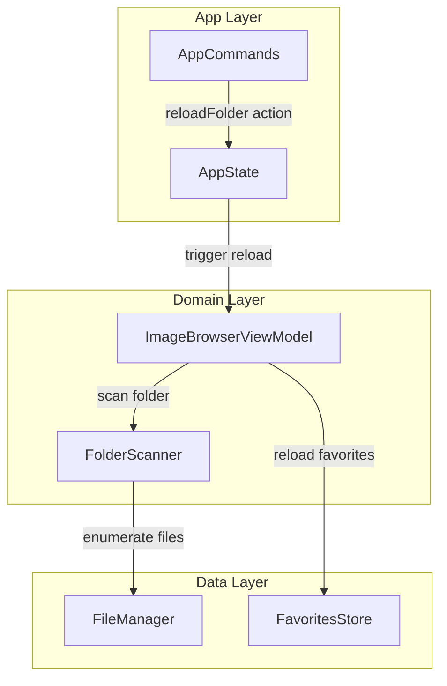
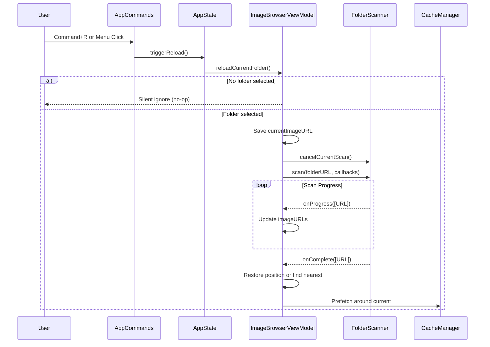
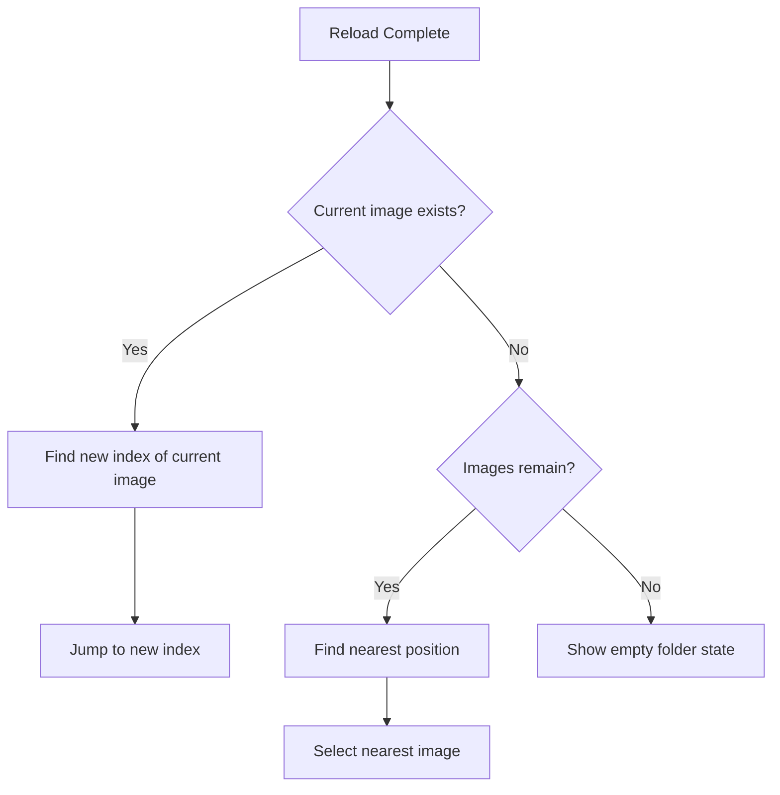

# Design: folder-reload

## Overview

**Purpose**: フォルダリロード機能は、AIviewで現在表示中のフォルダを再スキャンし、外部ツール（Finder、生成AIツール等）による画像の追加・削除をアプリ再起動なしで反映する機能を提供する。

**Users**: キーボード駆動のワークフローを重視するAIview利用者が、生成AIツールで画像を追加した後や、Finderで整理した後に最新の状態を確認するために使用する。

**Impact**: 既存の`ImageBrowserViewModel`に`reloadCurrentFolder`メソッドを追加し、`AppCommands`に「表示」メニューを新設してリロードコマンドを配置する。

### Goals

- Command+Rショートカットによる即座のフォルダリロード
- メニューバー「表示」メニューからの一貫したアクセス
- リロード後の表示位置維持（可能な限り同じ画像を表示継続）
- バックグラウンドスキャンによる操作継続性の確保

### Non-Goals

- 自動リロード（ファイルシステム監視による自動更新）
- リロード中のプログレスインジケーター表示
- Remote UIからのリロード操作
- リロード中断時の複雑なキャンセル処理（別フォルダ選択時は既存のキャンセル機構を流用）

## Architecture

### Existing Architecture Analysis

**現行アーキテクチャパターン**:
- Clean Architecture（App → Presentation → Domain → Data）
- Swift Concurrency（async/await、actor、Task）
- `@MainActor` + `@Observable` によるUI状態管理

**既存ドメイン境界**:
- `ImageBrowserViewModel`: UI状態管理とビジネスロジック統合
- `FolderScanner`: ディレクトリスキャン（actor分離）
- `AppCommands`: メニューコマンド定義
- `AppState`: アプリ全体状態（フォルダ選択ダイアログ等）

**維持すべき統合ポイント**:
- `FolderScanner.scan()` のコールバックパターン（onFirstImage, onProgress, onComplete）
- キャッシュ管理（`CacheManager`, `ThumbnailCacheManager`）の整合性
- お気に入り/フィルター状態の維持戦略

### Architecture Pattern & Boundary Map



**Architecture Integration**:
- 選択パターン: 既存のClean Architectureを維持
- ドメイン境界: `ImageBrowserViewModel`内にリロードロジックを追加（新コンポーネント不要）
- 既存パターン維持: `openFolder`と同様のスキャンフロー、状態リセット戦略
- 新コンポーネント: なし（`AppCommands`の拡張のみ）
- Steering準拠: Layer-based architecture、`@MainActor`アノテーション

### Technology Stack

| Layer | Choice / Version | Role in Feature | Notes |
|-------|------------------|-----------------|-------|
| Frontend / CLI | SwiftUI | メニューコマンド定義、キーボードショートカット | `CommandGroup`による「表示」メニュー追加 |
| Backend / Services | Swift 5.9+ | ViewModel、FolderScanner | 既存コンポーネント拡張 |
| Data / Storage | FileManager | ディレクトリ列挙 | 既存FolderScannerを再利用 |

## System Flows

### Reload Flow Sequence



### Position Restoration Logic



## Requirements Traceability

| Criterion ID | Summary | Components | Implementation Approach |
|--------------|---------|------------|------------------------|
| 1.1 | Command+Rでフォルダ再スキャン | AppCommands, AppState, ImageBrowserViewModel | 新規: reloadCurrentFolder()メソッド追加 |
| 1.2 | フォルダ未選択時は無視 | ImageBrowserViewModel | 新規: currentFolderURL == nil チェック |
| 1.3 | バックグラウンドスキャン | ImageBrowserViewModel, FolderScanner | 再利用: 既存scan()のasync実行 |
| 2.1 | 「表示」メニューに「フォルダをリロード」追加 | AppCommands | 新規: CommandGroup追加 |
| 2.2 | メニューにショートカット表示 | AppCommands | 新規: .keyboardShortcut("r") |
| 2.3 | メニュークリックでリロード実行 | AppCommands, AppState | 新規: triggerReload()アクション |
| 2.4 | フォルダ未選択時はメニュー無効化 | AppCommands, AppState | 新規: hasCurrentFolder状態監視 |
| 3.1 | 現在画像が存在すれば位置維持 | ImageBrowserViewModel | 新規: URL一致検索ロジック |
| 3.2 | 現在画像が削除された場合は最近接画像選択 | ImageBrowserViewModel | 新規: 最近接インデックス計算 |
| 3.3 | 空フォルダ時は空状態表示 | ImageBrowserViewModel | 再利用: 既存の空フォルダ処理 |
| 4.1 | 新規追加画像をリストに追加 | FolderScanner, ImageBrowserViewModel | 再利用: 既存scan()完全スキャン |
| 4.2 | 削除画像をリストから除去 | FolderScanner, ImageBrowserViewModel | 再利用: 既存scan()完全スキャン |
| 4.3 | 現在のソート順で並び替え | ImageBrowserViewModel | 再利用: 既存ソートロジック |

### Coverage Validation Checklist

- [x] Every criterion ID from requirements.md appears in the table above
- [x] Each criterion has specific component names (not generic references)
- [x] Implementation approach distinguishes "reuse existing" vs "new implementation"
- [x] User-facing criteria specify concrete UI components

## Components and Interfaces

| Component | Domain/Layer | Intent | Req Coverage | Key Dependencies (P0/P1) | Contracts |
|-----------|--------------|--------|--------------|--------------------------|-----------|
| ImageBrowserViewModel | Domain | リロード実行とUI状態管理 | 1.1, 1.2, 1.3, 3.1, 3.2, 3.3, 4.1, 4.2, 4.3 | FolderScanner (P0), CacheManager (P1) | Service, State |
| AppCommands | App | 「表示」メニュー定義 | 2.1, 2.2, 2.3, 2.4 | AppState (P0) | - |
| AppState | App | リロードトリガー状態管理 | 2.3, 2.4 | - | State |

### Domain Layer

#### ImageBrowserViewModel (Extension)

| Field | Detail |
|-------|--------|
| Intent | フォルダリロード機能を追加し、現在フォルダの再スキャンと状態復元を実行 |
| Requirements | 1.1, 1.2, 1.3, 3.1, 3.2, 3.3, 4.1, 4.2, 4.3 |

**Responsibilities & Constraints**
- 現在のフォルダURLを再スキャンし、画像リストを更新
- リロード前の表示位置を可能な限り復元
- サブディレクトリモード、フィルターモードの状態を適切に維持
- スライドショー実行中のリロードは許可（状態維持）

**Dependencies**
- Inbound: AppState (reloadトリガー) - P0
- Outbound: FolderScanner (スキャン実行) - P0
- Outbound: CacheManager (プリフェッチ) - P1

**Contracts**: Service [x] / State [x]

##### Service Interface

```swift
extension ImageBrowserViewModel {
    /// 現在のフォルダをリロード
    /// Requirements: 1.1, 1.2, 1.3, 3.1, 3.2, 3.3, 4.1, 4.2, 4.3
    /// - Returns: リロードが実行された場合はtrue、フォルダ未選択で無視された場合はfalse
    func reloadCurrentFolder() async -> Bool
}
```

- Preconditions: なし（フォルダ未選択時はfalseを返す）
- Postconditions:
  - currentFolderURLが存在する場合、imageURLsが最新のファイルシステム状態を反映
  - 可能な限り同じ画像が選択状態を維持
- Invariants:
  - currentFolderURLは変更されない
  - favorites辞書は再読み込みされない（既にメモリ上にある）

##### State Management

- State model:
  - `isReloading: Bool` - リロード中フラグ（オプション、将来のUI表示用）
- Persistence & consistency:
  - リロード中も現在画像は表示継続（isScanningFolder=trueでカバー）
- Concurrency strategy:
  - 既存のTask cancellationパターンを踏襲
  - リロード中に別フォルダが開かれた場合は既存のcancelCurrentScan()でキャンセル

**Implementation Notes**
- Integration: 既存の`openFolder`メソッドを参考に実装、ただしお気に入りの再読み込みは不要
- Validation: currentFolderURLの存在確認のみ
- Risks: サブディレクトリモード有効時のリロードでは、サブディレクトリ再スキャンも必要

### App Layer

#### AppCommands (Extension)

| Field | Detail |
|-------|--------|
| Intent | 「表示」メニューを追加し、フォルダリロードコマンドを提供 |
| Requirements | 2.1, 2.2, 2.3, 2.4 |

**Responsibilities & Constraints**
- 「表示」メニュー（View menu）を新規追加
- 「フォルダをリロード」項目にCommand+Rショートカットを割り当て
- フォルダ未選択時はメニュー項目を無効化

**Dependencies**
- Inbound: SwiftUI Commands framework - P0
- Outbound: AppState (状態参照・更新) - P0

**Contracts**: Service [ ] / State [ ]

**Implementation Notes**
- Integration: `CommandGroup(after: .toolbar)` または `CommandMenu("表示")` で「表示」メニューを追加
- Validation: `appState.hasCurrentFolder` で有効/無効を制御
- Risks: 既存の標準「View」メニューとの競合に注意（macOS標準のView menuは置換ではなく追加）

#### AppState (Extension)

| Field | Detail |
|-------|--------|
| Intent | リロードトリガー状態を管理し、ViewModelへの橋渡しを担当 |
| Requirements | 2.3, 2.4 |

**Responsibilities & Constraints**
- リロードリクエストを保持し、Viewで検知可能にする
- 現在フォルダの有無を公開（メニュー有効/無効判定用）

**Dependencies**
- Outbound: ImageBrowserViewModel (間接的にView経由) - P0

**Contracts**: State [x]

##### State Management

```swift
extension AppState {
    /// リロードが要求されているか（Viewで監視し、ViewModelに伝播）
    var shouldReloadFolder: Bool

    /// 現在フォルダが選択されているか（メニュー有効/無効判定用）
    var hasCurrentFolder: Bool

    /// リロードをトリガー
    func triggerReload()

    /// リロード完了をマーク
    func clearReloadRequest()
}
```

- Persistence & consistency: メモリのみ、永続化不要
- Concurrency strategy: @MainActor による単一スレッドアクセス

## Data Models

### Domain Model

本機能では新規エンティティの追加なし。既存の以下を使用：
- `imageURLs: [URL]` - 画像ファイルURLリスト
- `currentIndex: Int` - 現在選択インデックス
- `currentFolderURL: URL?` - 現在のフォルダURL

### Position Restoration Algorithm

リロード後の位置復元ロジック：

1. リロード前の`currentImageURL`を保存
2. スキャン完了後、新しい`imageURLs`から保存URLを検索
3. 見つかった場合: そのインデックスに`currentIndex`を設定
4. 見つからない場合:
   - 元のインデックス位置に最も近い有効インデックスを計算
   - `min(savedIndex, imageURLs.count - 1)` で上限クランプ
   - 空リストの場合は0に設定し、空状態を表示

## Error Handling

### Error Strategy

リロード機能は既存の`openFolder`と同じエラー処理パターンを踏襲：
- フォルダアクセスエラー: `errorMessage`に設定、ユーザーに通知
- スキャンキャンセル: 静かに無視（別操作による正常キャンセル）

### Error Categories and Responses

**User Errors**:
- フォルダ未選択でリロード: 静かに無視（1.2要件）

**System Errors**:
- フォルダ消失: `FolderScanError.folderNotFound` → errorMessage表示
- アクセス権限喪失: `FolderScanError.accessDenied` → errorMessage表示

## Testing Strategy

### Unit Tests

- `ImageBrowserViewModelReloadTests.swift`:
  1. `reloadCurrentFolder_whenNoFolderSelected_returnsFalse` - フォルダ未選択時の動作
  2. `reloadCurrentFolder_whenFolderSelected_updatesImageList` - 正常リロード
  3. `reloadCurrentFolder_preservesCurrentImage_whenStillExists` - 位置維持
  4. `reloadCurrentFolder_selectsNearestImage_whenCurrentDeleted` - 削除時の最近接選択
  5. `reloadCurrentFolder_showsEmptyState_whenFolderBecomesEmpty` - 空フォルダ対応

### Integration Tests

- `ReloadIntegrationTests.swift`:
  1. Menu command triggers reload correctly
  2. Command+R keyboard shortcut triggers reload
  3. Menu item disabled when no folder selected
  4. Reload respects subdirectory mode if enabled
  5. Reload during slideshow maintains slideshow state

### UI Tests

- `ReloadUITests.swift`:
  1. Verify "View" menu contains "Reload Folder" item
  2. Verify shortcut display in menu
  3. Verify menu item state changes with folder selection

## Design Decisions

### DD-001: openFolderロジックの再利用 vs 専用メソッド

| Field | Detail |
|-------|--------|
| Status | Accepted |
| Context | リロード機能を実装するにあたり、既存の`openFolder`メソッドを呼び出すか、専用の`reloadCurrentFolder`メソッドを新設するか |
| Decision | 専用の`reloadCurrentFolder`メソッドを新設し、`openFolder`の一部ロジックを再利用 |
| Rationale | `openFolder`はお気に入り再読み込み、履歴追加、サブディレクトリモードリセットを含む。リロードではこれらは不要であり、むしろ現在の状態を維持すべき |
| Alternatives Considered | 1) `openFolder`を直接呼び出す: お気に入りが不要に再読み込みされ、サブディレクトリモードがリセットされる問題 2) `openFolder`にフラグ引数追加: 複雑化、既存コードへの影響大 |
| Consequences | 重複コードが若干発生するが、リロード専用の明確なセマンティクスを維持できる。将来的なリロード固有の機能追加も容易 |

### DD-002: 位置復元戦略

| Field | Detail |
|-------|--------|
| Status | Accepted |
| Context | リロード後に表示位置をどのように復元するか。要件3.1, 3.2では「現在画像が存在すればその位置を維持」「存在しなければ最も近い位置の画像を選択」と規定 |
| Decision | URL完全一致による検索を優先し、不一致時は元インデックス位置を基準に最近接画像を選択 |
| Rationale | ファイル名でのマッチングは同名ファイルの問題があり、URL（フルパス）での一致が最も確実。最近接選択は作業の流れを最小限の中断で継続できる |
| Alternatives Considered | 1) ファイル名マッチング: 同名ファイルの誤マッチリスク 2) 最初の画像に戻る: ユーザー体験が大きく損なわれる 3) インデックス位置維持のみ: 画像追加時に意図しない画像が選択される |
| Consequences | URL変更（ファイル移動）は新規画像扱いとなるが、これは妥当な動作。リネームされた画像は検出できないが、リネーム検出は本機能のスコープ外 |

### DD-003: AppStateを経由したリロードトリガー

| Field | Detail |
|-------|--------|
| Status | Accepted |
| Context | メニューコマンドからViewModelのリロードをどのように呼び出すか |
| Decision | `AppState`に`shouldReloadFolder`フラグを設け、View層で監視してViewModelに伝播 |
| Rationale | 既存の`openRecentFolderURL`パターンと一貫性があり、SwiftUIのデータフローに適合。AppCommandsからViewModelへの直接参照を避けられる |
| Alternatives Considered | 1) NotificationCenter: 型安全性が低下、デバッグ困難 2) Environment経由のViewModel直接参照: AppCommandsがViewModel依存になり結合度上昇 3) Combine Publisher: 既存コードがObservableマクロ主体のため不整合 |
| Consequences | View層でのonChange監視コードが必要。ただし既存の`openRecentFolderURL`と同様のパターンで一貫性あり |

### DD-004: サブディレクトリモード・フィルターモード時のリロード動作

| Field | Detail |
|-------|--------|
| Status | Accepted |
| Context | サブディレクトリモードまたはお気に入りフィルターが有効な状態でリロードした場合の動作 |
| Decision | サブディレクトリモードおよびフィルターモードの状態を維持し、再スキャン後に同じ条件でフィルタリングを再適用 |
| Rationale | ユーザーがサブディレクトリモードやフィルター条件を選択した意図を尊重。モードリセットは予期せぬ動作となる。`openFolder`と異なり、リロードは「現在の表示状態を維持しつつ最新化」が目的であるため、すべてのビューモード設定を保持すべき |
| Alternatives Considered | 1) サブディレクトリモード/フィルターモードをリセット: ユーザーが再度有効化する手間が発生 2) モード有効時はリロード無効化: 機能制限が不自然 3) フィルターのみリセット: サブディレクトリモードとの一貫性がない |
| Consequences | `scanWithSubdirectories`の呼び出しが必要。現在のモード判定に基づいて適切なスキャンメソッドを選択する分岐が必要。リロード完了後に`filterLevel`が設定されている場合は`rebuildFilteredIndices()`を呼び出してフィルター結果を再構築 |

### DD-005: Open Question - リロード中の別フォルダ選択

| Field | Detail |
|-------|--------|
| Status | Proposed |
| Context | requirements.mdのOpen Questionに記載された「リロード中に別のフォルダが選択された場合の動作」 |
| Decision | 既存の`cancelCurrentScan()`機構を利用し、リロードをキャンセルして新フォルダを開く |
| Rationale | ユーザーの最新の意図（別フォルダを開く）を優先すべき。既存のスキャンキャンセル機構が利用可能であり、新規実装不要 |
| Alternatives Considered | 1) リロード完了を待つ: ユーザー体験の低下、待ち時間発生 2) 並行実行: 状態管理が複雑化、リソース消費増加 |
| Consequences | 既存の動作と一貫性があり、追加実装不要 |
