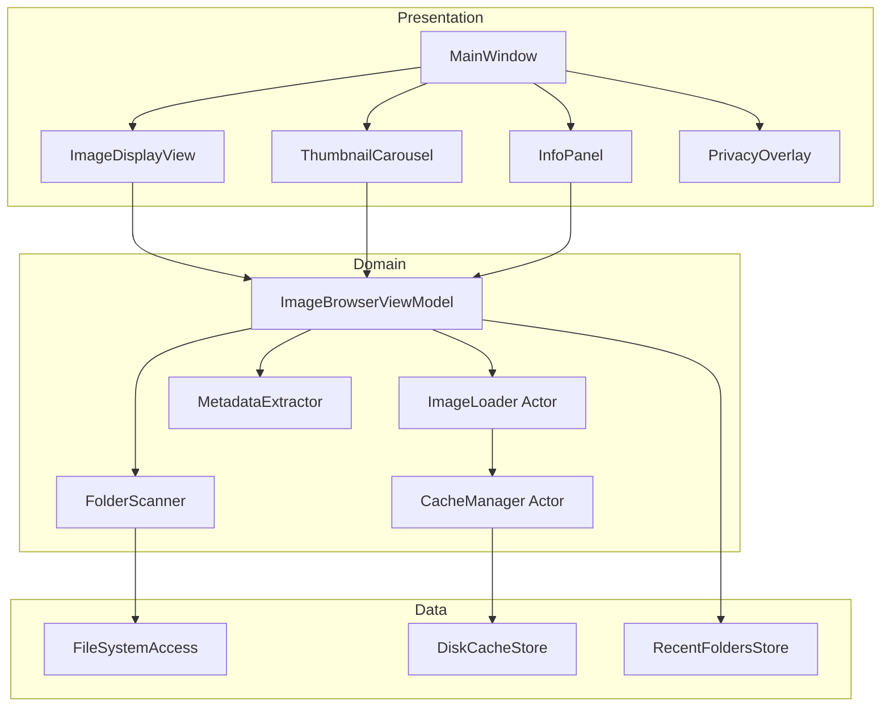
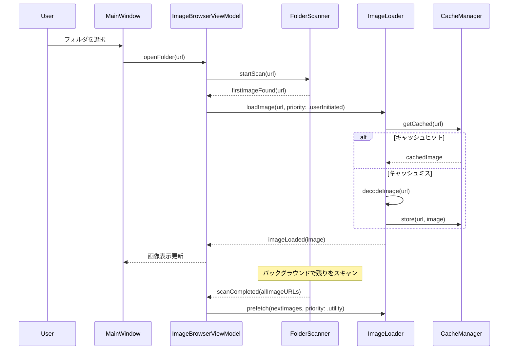
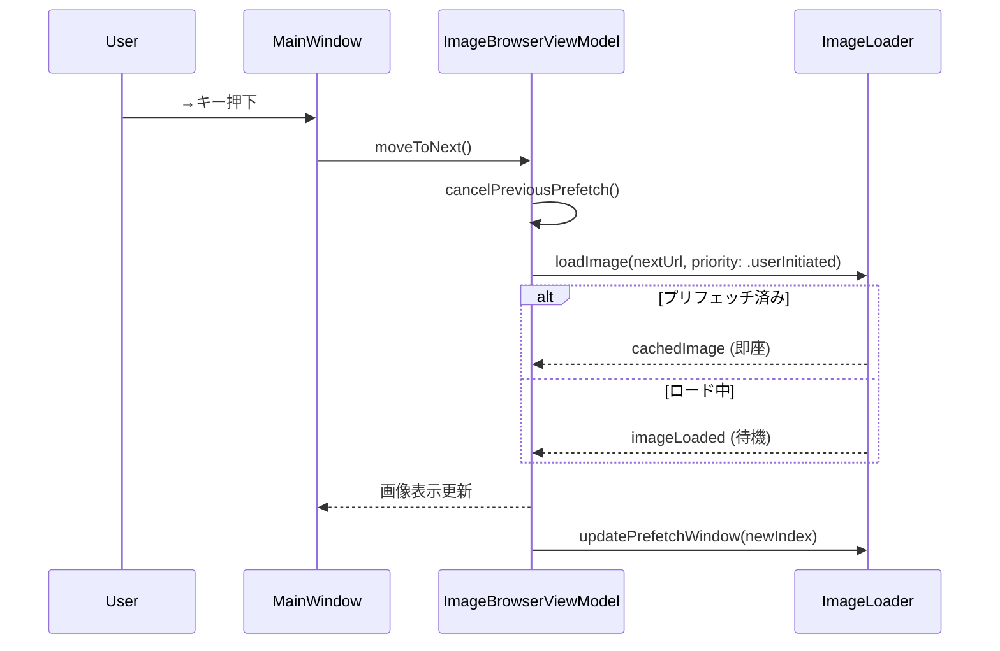
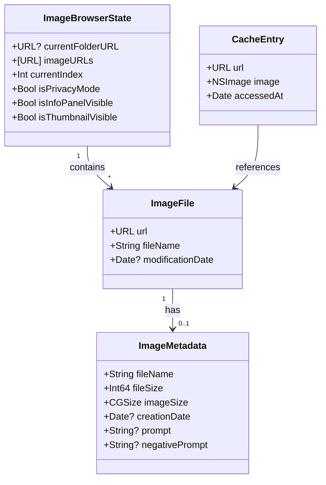

# Design Document

## Overview

**Purpose**: AIviewは、画像生成AI（Stable Diffusion等）で生成された大量画像を高速に確認・選別するためのmacOS向け画像ビューワーを提供する。

**Users**: 画像生成AIを利用するクリエイター・研究者が、生成画像の品質確認、不要画像の削除、プロンプト情報の確認を効率的に行うために使用する。

**Impact**: フォルダを開いた直後に最初の1枚が即表示され、カーソル連打でもUIが固まらない高速な画像閲覧体験を実現する。

### Goals
- 1000〜2000枚規模のフォルダでも最初の1枚を即座に表示
- カーソルキー連打時もUIをブロックせずスムーズに画像切り替え
- PNG tEXtチャンク/XMPからのプロンプト情報抽出と表示
- キーボードショートカットによる高速な削除・情報確認・プライバシーモード

### Non-Goals
- 画像編集機能（クロップ、フィルター等）
- クラウド連携・同期機能
- 複数フォルダの同時閲覧
- TIFF, RAW等の追加フォーマット対応（初期リリース）

## Architecture

### Architecture Pattern & Boundary Map

**Architecture Integration**:
- **Selected pattern**: SwiftUI + AppKit Hybrid with Clean Architecture layers
  - SwiftUIでモダンなUI構築、パフォーマンスクリティカルなサムネイルカルーセルはNSCollectionViewを使用
- **Domain/feature boundaries**: Presentation層（SwiftUI Views）、Domain層（ImageLoader, CacheManager）、Data層（FileSystem, ディスクキャッシュ）を分離
- **Existing patterns preserved**: なし（新規プロジェクト）
- **New components rationale**: 各層の責務を明確化し、テスト容易性と将来の拡張性を確保



### Technology Stack

| Layer | Choice / Version | Role in Feature | Notes |
|-------|------------------|-----------------|-------|
| Frontend | SwiftUI (macOS 13+) | UI構築、状態バインディング | @Observable / @Bindable使用 |
| Frontend | AppKit (NSCollectionView) | サムネイルカルーセル仮想化 | NSViewRepresentableでラップ |
| Backend | Swift Concurrency (actor) | 非同期画像ローディング、キャッシュ管理 | Task優先度でP0/P1/P2制御 |
| Data | ImageIO (CGImageSource) | 画像デコード、サムネイル生成 | ダウンサンプリング最適化 |
| Data | FileManager | ディレクトリ列挙、ファイル操作 | DirectoryEnumeratorでストリーミング |
| Data | UserDefaults / JSON | 最近開いたフォルダ履歴 | 軽量永続化 |
| Storage | File System (.aiview/) | サムネイルディスクキャッシュ | 対象フォルダ内に保存 |

## System Flows

### フォルダを開いて最初の1枚を表示するフロー



**Key Decisions**:
- 最初のファイルが見つかった時点で即座にデコード開始
- 残りのスキャンとプリフェッチはバックグラウンドで継続

### カーソルキーによる画像切り替えフロー



**Key Decisions**:
- 連打時は不要なプリフェッチをキャンセルしてリソース解放
- プリフェッチ済みの場合は即座に表示

## Requirements Traceability

| Requirement | Summary | Components | Interfaces | Flows |
|-------------|---------|------------|------------|-------|
| 1.1 | フォルダ選択ダイアログ表示 | MainWindow | FolderPicker | フォルダを開くフロー |
| 1.2 | 対応画像形式認識 | FolderScanner | FileFilter | スキャンフロー |
| 1.3 | 最初の1枚即表示 | FolderScanner, ImageLoader | StreamingEnumeration | 最初の1枚表示フロー |
| 1.4 | 履歴永続化 | RecentFoldersStore | Persistence | - |
| 1.5 | 最近使ったフォルダから開く | MainWindow, RecentFoldersStore | MenuAction | - |
| 2.1 | 最大サイズ表示 | ImageDisplayView | AspectFitRendering | - |
| 2.2 | サムネイルカルーセル | ThumbnailCarousel | NSCollectionView | - |
| 2.3 | 現在画像ハイライト | ThumbnailCarousel | SelectionState | - |
| 2.4 | 仮想化スクロール | ThumbnailCarousel | ViewRecycling | - |
| 2.5 | サムネイルクリック | ThumbnailCarousel | SelectionAction | - |
| 3.1-3.5 | キーボードナビゲーション | MainWindow, ViewModel | KeyboardHandler | 画像切り替えフロー |
| 3.6 | サムネイル表示トグル | MainWindow | ToggleAction | - |
| 4.1-4.4 | 画像削除 | ViewModel, FileSystemAccess | DeleteAction | 削除フロー |
| 5.1-5.7 | 画像情報表示 | InfoPanel, MetadataExtractor | MetadataDisplay | 情報表示フロー |
| 6.1-6.5 | プライバシーモード | PrivacyOverlay, ViewModel | GlobalKeyMonitor | プライバシーフロー |
| 7.1-7.4 | 最初の1枚最速表示 | FolderScanner, ImageLoader | StreamingDecode | 最初の1枚表示フロー |
| 8.1-8.5 | 先読み | ImageLoader, CacheManager | PrefetchQueue | プリフェッチフロー |
| 9.1-9.6 | サムネイル生成 | ImageLoader, DiskCacheStore | ThumbnailGeneration | サムネイル生成フロー |
| 9.7 | .aiviewフォルダ作成 | DiskCacheStore | FolderCreation | - |
| 10.1-10.5 | キャンセル戦略 | ImageLoader, ViewModel | TaskCancellation | キャンセルフロー |
| 11.1-11.4 | エラーハンドリング | 全コンポーネント | ErrorDisplay | - |

## Components and Interfaces

| Component | Domain/Layer | Intent | Req Coverage | Key Dependencies | Contracts |
|-----------|--------------|--------|--------------|------------------|-----------|
| MainWindow | Presentation | アプリメインウィンドウ、キーボードイベント処理 | 1.1, 1.5, 3.1-3.6, 6.1-6.5 | ImageBrowserViewModel (P0) | State |
| ImageDisplayView | Presentation | フル画像表示 | 2.1 | ImageBrowserViewModel (P0) | State |
| ThumbnailCarousel | Presentation | サムネイル一覧の仮想化スクロール | 2.2-2.5 | ImageBrowserViewModel (P0), NSCollectionView (P0) | State |
| InfoPanel | Presentation | 画像情報・プロンプト表示 | 5.1-5.7 | ImageBrowserViewModel (P0) | State |
| PrivacyOverlay | Presentation | プライバシーモード黒画面 | 6.1-6.3 | ImageBrowserViewModel (P0) | State |
| ImageBrowserViewModel | Domain | UI状態管理、ユーザー操作調整 | All | ImageLoader (P0), FolderScanner (P0), CacheManager (P1) | Service, State |
| ImageLoader | Domain | 非同期画像ローディング、優先度制御 | 7.1-7.4, 8.1-8.5, 10.1-10.5 | CacheManager (P0), ImageIO (P0) | Service |
| CacheManager | Domain | メモリLRU + ディスクキャッシュ管理 | 8.5, 9.4-9.6 | DiskCacheStore (P0) | Service |
| FolderScanner | Domain | ディレクトリストリーミング列挙 | 1.2, 1.3, 7.1-7.4 | FileSystemAccess (P0) | Service |
| MetadataExtractor | Domain | EXIF/PNG tEXt/XMPからのメタデータ抽出 | 5.2-5.6 | ImageIO (P0) | Service |
| FileSystemAccess | Data | ファイル操作、ゴミ箱移動 | 4.1-4.4, 11.2 | FileManager (P0) | Service |
| DiskCacheStore | Data | .aiviewフォルダへのサムネイル永続化 | 9.4-9.7 | FileManager (P0) | Service |
| RecentFoldersStore | Data | 最近開いたフォルダ履歴の永続化 | 1.4, 1.5 | UserDefaults (P0) | Service |

### Domain

#### ImageBrowserViewModel

| Field | Detail |
|-------|--------|
| Intent | UI状態の一元管理とユーザー操作の調整 |
| Requirements | 1.1-1.5, 2.1-2.5, 3.1-3.6, 4.1-4.4, 5.1-5.7, 6.1-6.5, 7.1-7.4, 8.1-8.5, 10.1-10.5 |

**Responsibilities & Constraints**
- 現在のフォルダ、画像リスト、選択インデックス、表示状態を保持
- プライバシーモード、情報パネル表示状態の管理
- UIからの操作を各Serviceに委譲

**Dependencies**
- Outbound: ImageLoader — 画像ローディング要求 (P0)
- Outbound: FolderScanner — フォルダスキャン開始 (P0)
- Outbound: MetadataExtractor — メタデータ取得 (P1)
- Outbound: FileSystemAccess — 削除操作 (P1)
- Outbound: RecentFoldersStore — 履歴更新 (P2)

**Contracts**: Service [x] / State [x]

##### State Management
```swift
@Observable
final class ImageBrowserViewModel {
    // State
    private(set) var currentFolderURL: URL?
    private(set) var imageURLs: [URL] = []
    private(set) var currentIndex: Int = 0
    private(set) var currentImage: NSImage?
    private(set) var isLoading: Bool = false
    private(set) var isPrivacyMode: Bool = false
    private(set) var isInfoPanelVisible: Bool = false
    private(set) var isThumbnailVisible: Bool = true
    private(set) var currentMetadata: ImageMetadata?
    private(set) var errorMessage: String?

    // Computed
    var currentImageURL: URL? { ... }
    var canMoveNext: Bool { ... }
    var canMovePrevious: Bool { ... }
}
```

##### Service Interface
```swift
protocol ImageBrowserViewModelProtocol: AnyObject, Sendable {
    // Folder operations
    func openFolder(_ url: URL) async
    func openRecentFolder(at index: Int) async

    // Navigation
    func moveToNext() async
    func moveToPrevious() async
    func jumpToIndex(_ index: Int) async

    // Actions
    func deleteCurrentImage() async throws
    func toggleInfoPanel()
    func toggleThumbnailCarousel()
    func togglePrivacyMode()

    // State access
    var currentImage: NSImage? { get }
    var imageURLs: [URL] { get }
    var currentIndex: Int { get }
}
```
- Preconditions: `openFolder`呼び出し前に有効なURL
- Postconditions: 状態更新後にUIが自動的に再描画
- Invariants: `currentIndex`は常に有効範囲内（画像がある場合）

**Implementation Notes**
- @Observableマクロによる自動状態監視
- async/awaitによる非同期操作
- MainActorで状態更新を保証

---

#### ImageLoader

| Field | Detail |
|-------|--------|
| Intent | 非同期画像ローディングと優先度制御 |
| Requirements | 7.1-7.4, 8.1-8.5, 10.1-10.5 |

**Responsibilities & Constraints**
- 優先度付きキュー（P0=表示, P1=先読み, P2=サムネイル）でデコードタスク管理
- Task.isCancelledによるキャンセル対応
- キャッシュヒット時は即座に返却

**Dependencies**
- Outbound: CacheManager — キャッシュ読み書き (P0)
- External: ImageIO (CGImageSource) — 画像デコード (P0)

**Contracts**: Service [x]

##### Service Interface
```swift
actor ImageLoader {
    enum Priority {
        case display      // P0: 表示中の画像
        case prefetch     // P1: 先読み（進行方向優先）
        case thumbnail    // P2: サムネイル生成
    }

    func loadImage(
        from url: URL,
        priority: Priority,
        targetSize: CGSize?
    ) async throws -> NSImage

    func prefetch(
        urls: [URL],
        priority: Priority,
        direction: PrefetchDirection
    ) async

    func cancelPrefetch(for urls: [URL])

    func cancelAllExcept(_ activeURL: URL)
}

enum PrefetchDirection {
    case forward
    case backward
}
```
- Preconditions: 有効なファイルURLを渡すこと
- Postconditions: 成功時はデコード済みNSImageを返却
- Invariants: actorにより内部状態はスレッドセーフ

**Implementation Notes**
- `CGImageSourceCreateThumbnailAtIndex`でダウンサンプリング
- 進行中タスクをDictionaryで追跡し重複防止
- `withTaskCancellationHandler`でキャンセル時のクリーンアップ

---

#### CacheManager

| Field | Detail |
|-------|--------|
| Intent | 二層キャッシュ（メモリLRU + ディスク永続）の管理 |
| Requirements | 8.5, 9.4-9.6 |

**Responsibilities & Constraints**
- メモリキャッシュ: フルサイズ画像のLRU管理（最大100枚程度）
- ディスクキャッシュ: サムネイルの永続化（.aiview/フォルダ）
- メモリ警告時のキャッシュ解放

**Dependencies**
- Outbound: DiskCacheStore — ディスクキャッシュI/O (P0)

**Contracts**: Service [x]

##### Service Interface
```swift
actor CacheManager {
    // Memory cache
    func getCachedImage(for url: URL) -> NSImage?
    func cacheImage(_ image: NSImage, for url: URL)
    func evictImage(for url: URL)

    // Thumbnail cache (disk-backed)
    func getCachedThumbnail(for url: URL, size: CGSize) async -> NSImage?
    func cacheThumbnail(_ image: NSImage, for url: URL, size: CGSize) async

    // Maintenance
    func clearMemoryCache()
    func handleMemoryWarning()
}
```
- Preconditions: なし
- Postconditions: キャッシュ操作後は一貫した状態を維持
- Invariants: LRUの最大サイズを超えない

**Implementation Notes**
- キャッシュキー: `<filename>_<modificationDate>_<size>`
- メモリ警告はNotificationCenterで監視
- LRUはダブルリンクリスト + Dictionary実装

---

#### FolderScanner

| Field | Detail |
|-------|--------|
| Intent | ディレクトリのストリーミング列挙と画像フィルタリング |
| Requirements | 1.2, 1.3, 7.1-7.4 |

**Responsibilities & Constraints**
- DirectoryEnumeratorによる遅延列挙
- 最初のファイルが見つかった時点で即座にコールバック
- 対応拡張子のみをフィルタリング

**Dependencies**
- Outbound: FileSystemAccess — ファイル属性取得 (P0)

**Contracts**: Service [x]

##### Service Interface
```swift
actor FolderScanner {
    static let supportedExtensions: Set<String> = ["jpg", "jpeg", "png", "heic", "webp", "gif"]

    func scan(
        folderURL: URL,
        onFirstImage: @Sendable (URL) async -> Void,
        onProgress: @Sendable ([URL]) async -> Void,
        onComplete: @Sendable ([URL]) async -> Void
    ) async throws

    func cancelCurrentScan()
}
```
- Preconditions: 有効なディレクトリURL
- Postconditions: `onComplete`呼び出し時に全画像URLが含まれる
- Invariants: キャンセル後は`onComplete`が呼ばれない

**Implementation Notes**
- `FileManager.enumerator(at:includingPropertiesForKeys:options:errorHandler:)`使用
- `includingPropertiesForKeys`に`.contentModificationDateKey`等を指定
- 拡張子フィルタはcase-insensitive

---

#### MetadataExtractor

| Field | Detail |
|-------|--------|
| Intent | 画像からEXIF/PNG tEXt/XMPメタデータを抽出 |
| Requirements | 5.2-5.6 |

**Responsibilities & Constraints**
- CGImageSourceから標準メタデータ（EXIF等）を取得
- PNGの場合はtEXtチャンクをバイナリパースしプロンプト抽出
- XMPへのフォールバック

**Dependencies**
- External: ImageIO (CGImageSource) — メタデータ読み取り (P0)

**Contracts**: Service [x]

##### Service Interface
```swift
struct ImageMetadata: Sendable {
    let fileName: String
    let fileSize: Int64
    let imageSize: CGSize
    let creationDate: Date?
    let prompt: String?
    let negativePrompt: String?
    let additionalInfo: [String: String]
}

actor MetadataExtractor {
    func extractMetadata(from url: URL) async throws -> ImageMetadata
}
```
- Preconditions: 有効な画像ファイルURL
- Postconditions: 必須フィールド（fileName, fileSize, imageSize）は常に含まれる
- Invariants: なし

**Implementation Notes**
- tEXtチャンクパース: `parameters\x00(.*?)(?:\x00|\xFF|\x89PNG)`
- XMPパース: `<x:xmpmeta>...</x:xmpmeta>`内の`parameters="..."`
- プロンプト分離: `Negative prompt:`と`Steps:`を区切りとして使用

---

### Data

#### FileSystemAccess

| Field | Detail |
|-------|--------|
| Intent | ファイル操作とゴミ箱移動の抽象化 |
| Requirements | 4.1-4.4, 11.2 |

**Responsibilities & Constraints**
- NSFileManagerのtrashItem(at:resultingItemURL:)によるゴミ箱移動
- アクセス権限エラーのハンドリング

**Dependencies**
- External: FileManager (P0)

**Contracts**: Service [x]

##### Service Interface
```swift
protocol FileSystemAccessProtocol: Sendable {
    func moveToTrash(_ url: URL) async throws
    func checkAccess(to url: URL) -> Bool
    func getFileAttributes(_ url: URL) throws -> FileAttributes
}

struct FileAttributes: Sendable {
    let size: Int64
    let modificationDate: Date
    let creationDate: Date?
}
```

---

#### DiskCacheStore

| Field | Detail |
|-------|--------|
| Intent | .aiviewフォルダへのサムネイル永続化 |
| Requirements | 9.4-9.7 |

**Responsibilities & Constraints**
- 対象フォルダ内に`.aiview/`サブフォルダを作成
- サムネイルをJPEG形式で保存（容量効率）
- キャッシュキーにファイル名・更新日時・サイズを含める

**Dependencies**
- External: FileManager (P0)

**Contracts**: Service [x]

##### Service Interface
```swift
actor DiskCacheStore {
    func getThumbnail(
        originalURL: URL,
        thumbnailSize: CGSize,
        modificationDate: Date
    ) async -> Data?

    func storeThumbnail(
        _ data: Data,
        originalURL: URL,
        thumbnailSize: CGSize,
        modificationDate: Date
    ) async throws

    func clearCache(for folderURL: URL) async throws
}
```

**Implementation Notes**
- キャッシュファイル名: `<sha256(originalPath)>_<modDate>_<width>x<height>.jpg`
- `.aiview/`フォルダは隠しフォルダとして作成

---

#### RecentFoldersStore

| Field | Detail |
|-------|--------|
| Intent | 最近開いたフォルダ履歴の永続化 |
| Requirements | 1.4, 1.5 |

**Responsibilities & Constraints**
- 最大10件の履歴を保持
- アプリ再起動後も保持

**Dependencies**
- External: UserDefaults (P0)

**Contracts**: Service [x]

##### Service Interface
```swift
protocol RecentFoldersStoreProtocol: Sendable {
    func getRecentFolders() -> [URL]
    func addRecentFolder(_ url: URL)
    func removeRecentFolder(_ url: URL)
    func clearRecentFolders()

    // Security-Scoped Bookmark support
    func getBookmarkData(for url: URL) -> Data?
    func restoreURL(from bookmarkData: Data) -> URL?
    func startAccessingFolder(_ url: URL) -> Bool
    func stopAccessingFolder(_ url: URL)
}
```

**Implementation Notes**
- UserDefaultsにはURL文字列ではなくSecurity-Scoped Bookmark Dataを保存
- `url.bookmarkData(options: .withSecurityScope)`でBookmarkを生成
- アプリ再起動後は`URL(resolvingBookmarkData:options:bookmarkDataIsStale:)`で復元
- フォルダアクセス前に`startAccessingSecurityScopedResource()`を呼び出し
- アクセス終了時は`stopAccessingSecurityScopedResource()`で解放

---

### Presentation

#### MainWindow

| Field | Detail |
|-------|--------|
| Intent | アプリメインウィンドウとキーボードイベント処理 |
| Requirements | 1.1, 1.5, 3.1-3.6, 6.1-6.5 |

**Implementation Notes**
- NSWindowDelegateでグローバルキーイベント監視
- スペースキーはプライバシーモードトグル（ダイアログ表示中も有効）
- メニューバーに「ファイル」→「フォルダを開く」「最近使ったフォルダ」を配置

---

#### ThumbnailCarousel

| Field | Detail |
|-------|--------|
| Intent | NSCollectionViewベースの仮想化サムネイルカルーセル |
| Requirements | 2.2-2.5 |

**Implementation Notes**
- NSViewRepresentableでNSCollectionViewをラップ
- NSCollectionViewFlowLayoutで横スクロール設定
- セル再利用でメモリ効率化
- 選択中セルは青枠でハイライト

---

## Data Models

### Domain Model



### Logical Data Model

**サムネイルディスクキャッシュ構造**:
```
<対象フォルダ>/
└── .aiview/
    ├── <hash1>_<modDate>_120x120.jpg
    ├── <hash2>_<modDate>_120x120.jpg
    └── ...
```

**最近開いたフォルダ履歴（UserDefaults）**:
```json
{
  "recentFolders": [
    "/Users/user/Pictures/generated",
    "/Users/user/Downloads/batch1"
  ]
}
```

## Error Handling

### Error Strategy
- **Fail Fast**: ファイルアクセスエラーは即座にユーザーに通知
- **Graceful Degradation**: 破損画像は「読み込み失敗」プレースホルダーを表示し、次の画像への移動を許可
- **User Context**: エラーメッセージは日本語で具体的なアクション指示を含める

### Error Categories and Responses

| Category | Error | Response |
|----------|-------|----------|
| User Errors | フォルダアクセス権限なし | アラートダイアログで権限付与を案内 |
| System Errors | 画像デコード失敗 | プレースホルダー表示、ナビゲーション継続可能 |
| System Errors | ディスクキャッシュ書き込み失敗 | 警告ログ出力、メモリキャッシュのみで動作継続 |
| Business Logic | 最後の画像を削除 | 「画像がありません」状態を表示 |
| Business Logic | 削除操作失敗 | エラーメッセージ表示、画像リスト維持 |

### Monitoring
- Console.appへの構造化ログ出力（os_log使用）
- エラー発生時のファイルパス・エラーコードをログに記録

## Testing Strategy

### Unit Tests
- ImageLoader: キャッシュヒット/ミス、優先度順序、キャンセル動作
- CacheManager: LRU eviction、ディスクキャッシュ読み書き
- MetadataExtractor: PNG tEXtパース、XMPフォールバック、プロンプト分離
- FolderScanner: 拡張子フィルタリング、ストリーミング列挙

### Integration Tests
- フォルダ→スキャン→表示の一連フロー
- 削除→次画像表示→リスト更新のフロー
- プリフェッチ→キーボードナビゲーション→表示のフロー

### Performance Tests
- 2000枚フォルダの初回表示時間（目標: 最初の1枚が500ms以内）
- カーソルキー連打時のフレームレート（目標: 60fps維持）
- サムネイルカルーセルスクロール時のメモリ使用量

## Performance & Scalability

### Target Metrics
| Metric | Target |
|--------|--------|
| 最初の1枚表示 | < 500ms（フォルダ選択から） |
| 次画像表示（プリフェッチ済み） | < 50ms |
| 次画像表示（キャッシュミス） | < 200ms |
| サムネイルスクロール | 60fps維持 |
| メモリ使用量（2000枚フォルダ） | < 500MB |

### Optimization Techniques
- **ダウンサンプリング**: 表示サイズに合わせたデコード
- **プリフェッチ**: 前3枚/後12枚を先読み
- **LRUキャッシュ**: 100枚をメモリ保持、古いものから解放
- **ビュー再利用**: NSCollectionViewのセル再利用機構
- **キャンセル戦略**: 不要タスクの即時キャンセル

### Large Image Handling
巨大解像度画像（10000x10000以上）に対するメモリ制限:
- **最大デコードサイズ**: 8192x8192ピクセル
- **適用閾値**: 100メガピクセル（10000x10000相当）以上
- **処理方法**: `CGImageSourceCreateThumbnailAtIndex`のダウンサンプリングオプションで縮小デコード
- **オプション設定**: `kCGImageSourceThumbnailMaxPixelSize`に8192を指定
