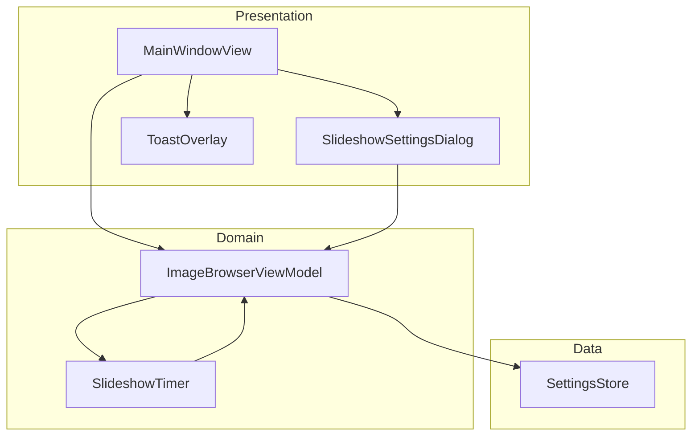
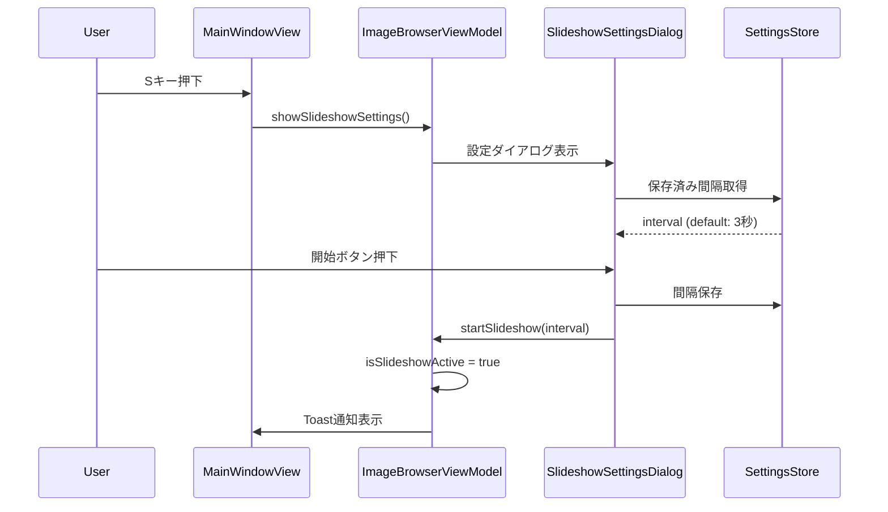
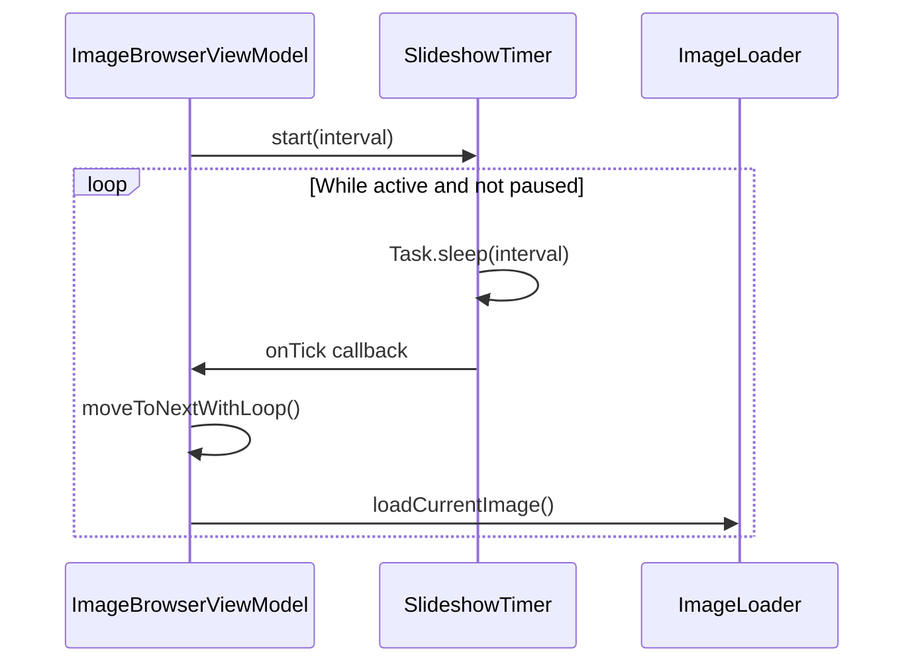
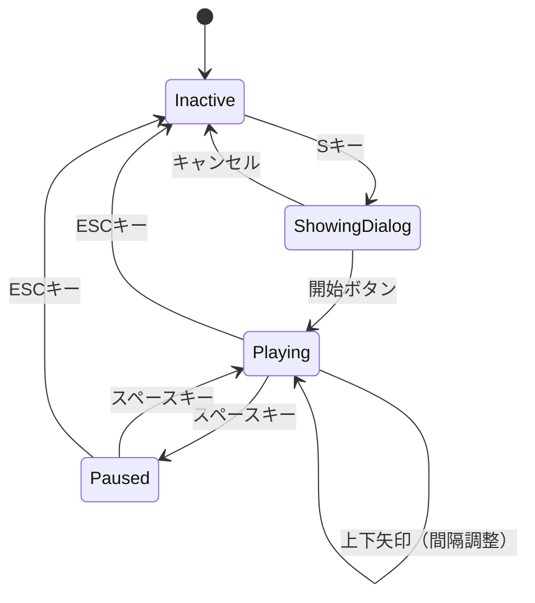

# Design Document - スライドショー機能

## Overview

**Purpose**: 本機能は、AIviewアプリケーションに自動画像切り替え再生機能を提供し、大量のAI生成画像をハンズフリーで閲覧・レビューするユースケースを実現する。

**Users**: AI画像生成ユーザーが、生成セッションの成果物を効率的にレビューするために使用する。

**Impact**: 既存の画像ナビゲーション機能を拡張し、キーボード操作による再生制御と設定永続化を追加する。

### Goals
- 1-60秒の可変間隔での自動画像切り替え再生
- キーボード操作による直感的な再生制御（開始/一時停止/終了/間隔調整）
- 設定の永続化によるユーザー体験の向上
- 既存UIとのシームレスな統合

### Non-Goals
- マウス操作による制御（キーボード中心のワークフローを維持）
- 画像エフェクトやトランジションアニメーション
- プレイリスト機能やランダム再生

## Architecture

> 詳細な調査結果は `research.md` を参照。

### Existing Architecture Analysis
- **Clean Architecture**: App → Presentation → Domain → Data の層構造
- **状態管理**: `@Observable`マクロによるリアクティブ状態
- **キーボード処理**: `MainWindowView`の`.onKeyPress`修飾子
- **ナビゲーション**: `ImageBrowserViewModel`の`moveToNext()`/`moveToPrevious()`

### Architecture Pattern & Boundary Map



**Architecture Integration**:
- **Selected pattern**: 既存ViewModel統合（状態一元管理）
- **Domain boundaries**: スライドショー状態はImageBrowserViewModelに追加
- **Existing patterns preserved**: `@Observable`, `@MainActor`, `Task.sleep`タイマー
- **New components rationale**:
  - SlideshowSettingsDialog: 開始時設定UI（新規）
  - ToastOverlay: 状態通知UI（新規・汎用再利用可）
  - SlideshowTimer: タイマーロジック分離（新規）
- **Steering compliance**: Clean Architecture層構造を維持

### Technology Stack

| Layer | Choice / Version | Role in Feature | Notes |
|-------|------------------|-----------------|-------|
| Frontend | SwiftUI (macOS 14+) | 設定ダイアログ、Toast表示 | @Observable対応 |
| Domain | Swift Concurrency | タイマー処理、状態管理 | Task.sleepパターン |
| Data | UserDefaults | 間隔設定永続化 | SettingsStore拡張 |

## System Flows

### スライドショー開始フロー



### スライドショー再生ループ



### 制御操作フロー



## Requirements Traceability

| Requirement | Summary | Components | Interfaces | Flows |
|-------------|---------|------------|------------|-------|
| 1.1, 1.2, 1.3, 1.4, 1.5 | 開始と設定 | SlideshowSettingsDialog, ImageBrowserViewModel | SlideshowSettings | 開始フロー |
| 2.1, 2.2, 2.3, 2.4 | 自動再生 | SlideshowTimer, ImageBrowserViewModel | SlideshowTimerProtocol | 再生ループ |
| 3.1, 3.2, 3.3, 3.4 | 一時停止/再開 | ImageBrowserViewModel, ToastOverlay | - | 制御フロー |
| 4.1, 4.2 | 手動ナビゲーション | MainWindowView, ImageBrowserViewModel | - | 制御フロー |
| 5.1, 5.2, 5.3 | 間隔調整 | ImageBrowserViewModel, ToastOverlay | - | 制御フロー |
| 6.1, 6.2, 6.3, 6.4 | 終了 | ImageBrowserViewModel, SlideshowTimer | - | 制御フロー |
| 7.1, 7.2, 7.3 | 設定永続化 | SettingsStore | - | 開始フロー |
| 8.1, 8.2, 8.3 | UI統合 | MainWindowView, SlideshowSettingsDialog | - | 全フロー |

## Components and Interfaces

| Component | Domain/Layer | Intent | Req Coverage | Key Dependencies | Contracts |
|-----------|--------------|--------|--------------|------------------|-----------|
| ImageBrowserViewModel | Domain | スライドショー状態管理 | 1-8全て | SlideshowTimer(P0), SettingsStore(P1) | State |
| SlideshowTimer | Domain | タイマーロジック | 2.1, 4.1, 4.2, 6.3 | なし | Service |
| SlideshowSettingsDialog | Presentation | 設定UI | 1.1-1.5, 7.2, 8.3 | ImageBrowserViewModel(P0) | - |
| ToastOverlay | Presentation | 通知表示 | 1.5, 3.3, 3.4, 5.3, 6.2 | なし | - |
| SettingsStore | Data | 設定永続化 | 7.1-7.3 | UserDefaults(P0) | State |
| MainWindowView | Presentation | キーボード処理拡張 | 1.1, 3.1-3.2, 4.1-4.2, 5.1-5.2, 6.1 | ImageBrowserViewModel(P0) | - |

### Domain Layer

#### ImageBrowserViewModel（拡張）

| Field | Detail |
|-------|--------|
| Intent | スライドショー状態の管理と制御操作の処理 |
| Requirements | 1.1-1.5, 2.1-2.4, 3.1-3.4, 4.1-4.2, 5.1-5.3, 6.1-6.4, 7.1-7.3, 8.1-8.2 |

**Responsibilities & Constraints**
- スライドショーの状態（アクティブ/一時停止）管理
- 再生制御操作（開始/一時停止/再開/終了）の処理
- 間隔調整とループナビゲーションの実行
- カルーセル表示状態の自動制御

**Dependencies**
- Inbound: MainWindowView — キーボードイベント (P0)
- Inbound: SlideshowSettingsDialog — 開始要求 (P0)
- Outbound: SlideshowTimer — タイマー制御 (P0)
- Outbound: SettingsStore — 設定読み書き (P1)

**Contracts**: State [x]

##### State Management

```swift
// スライドショー状態プロパティ
@MainActor
@Observable
extension ImageBrowserViewModel {
    // 状態
    private(set) var isSlideshowActive: Bool = false
    private(set) var isSlideshowPaused: Bool = false
    private(set) var slideshowInterval: Int = 3 // 秒
    var showSlideshowSettings: Bool = false

    // 計算プロパティ
    var slideshowStatusText: String {
        if isSlideshowPaused { return "一時停止中" }
        if isSlideshowActive { return "再生中 \(slideshowInterval)秒" }
        return ""
    }

    // カルーセル状態保存用
    private var thumbnailVisibleBeforeSlideshow: Bool = true
}
```

- **State model**: isSlideshowActive, isSlideshowPaused, slideshowInterval
- **Persistence**: slideshowIntervalのみSettingsStoreに永続化
- **Concurrency**: @MainActorでUI安全性を保証

**Implementation Notes**
- 既存のisThumbnailVisibleをスライドショー開始時にfalseに設定
- 終了時に元の状態（thumbnailVisibleBeforeSlideshow）に復元
- 手動ナビゲーション時はタイマーリセットを実行

---

#### SlideshowTimer

| Field | Detail |
|-------|--------|
| Intent | スライドショーの自動進行タイマー管理 |
| Requirements | 2.1, 4.1, 4.2, 6.3 |

**Responsibilities & Constraints**
- 指定間隔でのコールバック実行
- 一時停止/再開/停止制御
- タイマーリセット（手動ナビゲーション時）

**Dependencies**
- Inbound: ImageBrowserViewModel — タイマー制御 (P0)

**Contracts**: Service [x]

##### Service Interface

```swift
protocol SlideshowTimerProtocol {
    func start(interval: Int, onTick: @escaping () async -> Void)
    func pause()
    func resume()
    func stop()
    func reset()
    var isRunning: Bool { get }
}

@MainActor
final class SlideshowTimer: SlideshowTimerProtocol {
    private var timerTask: Task<Void, Never>?
    private var isPaused: Bool = false
    private var currentInterval: Int = 3
    private var onTickHandler: (() async -> Void)?

    var isRunning: Bool { timerTask != nil && !isPaused }

    func start(interval: Int, onTick: @escaping () async -> Void)
    func pause()
    func resume()
    func stop()
    func reset()
}
```

- **Preconditions**: interval は 1-60 の範囲
- **Postconditions**: stop()後はtimerTaskがnil
- **Invariants**: 同時に複数のタイマーTaskは存在しない

**Implementation Notes**
- Task.sleep(nanoseconds:)を使用したループ実装
- キャンセル時はTask.isCancelledをチェック
- reset()の詳細動作:
  - reset()は現在の待機中のTask.sleepをキャンセルし、現在の間隔設定で即座に新しい待機サイクルを開始する
  - つまり、reset()呼び出し後、設定された間隔の全時間が経過してから次のonTickが発生する

---

### Presentation Layer

#### SlideshowSettingsDialog

| Field | Detail |
|-------|--------|
| Intent | スライドショー開始前の設定UI |
| Requirements | 1.1, 1.2, 1.3, 1.4, 1.5, 7.2, 8.3 |

**Responsibilities & Constraints**
- 表示間隔の設定（1-60秒、スライダー）
- キーボード操作ヘルプの表示
- 開始/キャンセルボタン

**Dependencies**
- Inbound: MainWindowView — Sheet表示 (P0)
- Outbound: ImageBrowserViewModel — 開始要求 (P0)
- Outbound: SettingsStore — 間隔読み込み (P1)

**Contracts**: なし（UI専用）

**Implementation Notes**
- SwiftUI Sheetとして表示
- スライダーは整数ステップ（1秒単位）
- ヘルプ情報: Space=一時停止, ESC=終了, 矢印=ナビゲーション, 上下=間隔調整

---

#### ToastOverlay

| Field | Detail |
|-------|--------|
| Intent | 一時的な状態通知の表示 |
| Requirements | 1.5, 3.3, 3.4, 5.3, 6.2 |

**Responsibilities & Constraints**
- 通知メッセージの表示（2秒後に自動非表示）
- 複数通知の連続表示対応
- 画面下部中央に表示

**Dependencies**
- Inbound: MainWindowView — 通知要求 (P0)

**Contracts**: なし（UI専用）

**Implementation Notes**
- ZStackで画像表示上にオーバーレイ
- フェードイン/アウトアニメーション
- 背景: 半透明黒（.ultraThinMaterial相当）
- 汎用コンポーネントとして設計（将来の他機能でも再利用可能）
- 連続通知の処理:
  - 新しい通知が発生した場合、現在表示中の通知を即座に置き換える（キューイングしない）
  - 自動非表示タイマーは新しい通知で再スタートする

---

#### MainWindowView（拡張）

| Field | Detail |
|-------|--------|
| Intent | スライドショー用キーボードハンドリングの追加 |
| Requirements | 1.1, 3.1, 3.2, 4.1, 4.2, 5.1, 5.2, 6.1 |

**Responsibilities & Constraints**
- 既存のhandleKeyPress関数にスライドショー制御を追加
- スライドショー状態に応じたキー処理の分岐

**Dependencies**
- Outbound: ImageBrowserViewModel — 状態参照・操作 (P0)

**Contracts**: なし（既存拡張）

**Implementation Notes**
- Sキー: showSlideshowSettings = true
- スライドショーアクティブ時:
  - Space: toggleSlideshowPause()
  - ESC: stopSlideshow()
  - 左右矢印: 既存ナビ + タイマーリセット
  - 上下矢印: adjustSlideshowInterval(+1/-1)
- 既存キー処理との競合回避（スライドショー中は上下矢印を間隔調整に使用）

---

### Data Layer

#### SettingsStore（拡張）

| Field | Detail |
|-------|--------|
| Intent | スライドショー間隔設定の永続化 |
| Requirements | 7.1, 7.2, 7.3 |

**Responsibilities & Constraints**
- slideshowIntervalSecondsキーでUserDefaultsに保存
- デフォルト値: 3秒

**Dependencies**
- External: UserDefaults — 永続ストレージ (P0)

**Contracts**: State [x]

##### State Management

```swift
extension SettingsStore {
    private enum SlideshowKeys {
        static let slideshowIntervalSeconds = "slideshowIntervalSeconds"
    }

    static let defaultSlideshowInterval: Int = 3

    var slideshowIntervalSeconds: Int {
        get { defaults.integer(forKey: SlideshowKeys.slideshowIntervalSeconds) }
        set { defaults.set(newValue, forKey: SlideshowKeys.slideshowIntervalSeconds) }
    }
}
```

- **State model**: slideshowIntervalSeconds (Int, 1-60)
- **Persistence**: UserDefaultsに即時保存
- **Consistency**: registerDefaults()でデフォルト値を登録

## Data Models

### Domain Model

スライドショー機能は永続的なドメインエンティティを持たない。状態はViewModelのプロパティとして管理し、設定値のみUserDefaultsに永続化する。

**Value Objects**:
- `SlideshowState`: enum { inactive, playing, paused }（実装ではBoolプロパティで代替）
- `SlideshowInterval`: 1-60秒の整数値

**Domain Events**:
- `SlideshowStarted(interval: Int)`
- `SlideshowPaused`
- `SlideshowResumed`
- `SlideshowStopped`
- `SlideshowIntervalChanged(newInterval: Int)`

### Logical Data Model

**SlideshowSettings Entity**:

| Attribute | Type | Constraints | Notes |
|-----------|------|-------------|-------|
| intervalSeconds | Int | 1 ≤ x ≤ 60 | デフォルト: 3 |

**Consistency**:
- 単一値のみ、トランザクション不要
- 即時書き込み（.set()）

## Error Handling

### Error Strategy

スライドショー機能は基本的にエラーが発生しにくい設計。主なエラーケースと対応:

### Error Categories and Responses

**User Errors**:
- 画像が0枚の状態でスライドショー開始 → 開始ボタンを無効化
- 範囲外の間隔設定 → UIスライダーで1-60に制限

**System Errors**:
- タイマーTask異常終了 → 自動再起動またはスライドショー終了
- 設定読み込み失敗 → デフォルト値にフォールバック

**Slideshow-specific Errors**:
- 画像読み込み失敗時の動作:
  - スライドショー再生中に画像読み込みが失敗した場合、その画像をスキップして次の画像に自動的に進む
  - 3回連続で失敗した場合はスライドショーを停止し、エラー通知を表示

### Monitoring

- os.Loggerでスライドショー開始/終了/エラーをログ出力
- カテゴリ: `slideshow`

## Testing Strategy

### Unit Tests
- `SlideshowTimerTests`: start/pause/resume/stop/reset動作検証
- `ImageBrowserViewModelSlideshowTests`: 状態遷移、間隔調整、ループナビゲーション
- `SettingsStoreSlideshowTests`: 間隔の保存/読み込み/デフォルト値

### Integration Tests
- キーボード操作からスライドショー開始/制御のE2Eフロー
- カルーセル表示状態の自動制御検証
- Toast通知の表示検証

### UI Tests
- SlideshowSettingsDialogのスライダー操作
- ToastOverlayの表示/非表示アニメーション
